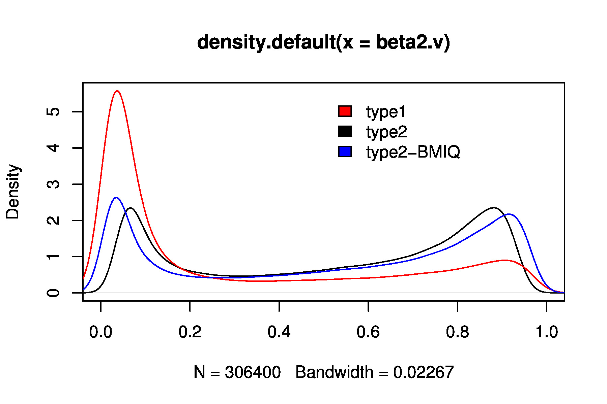
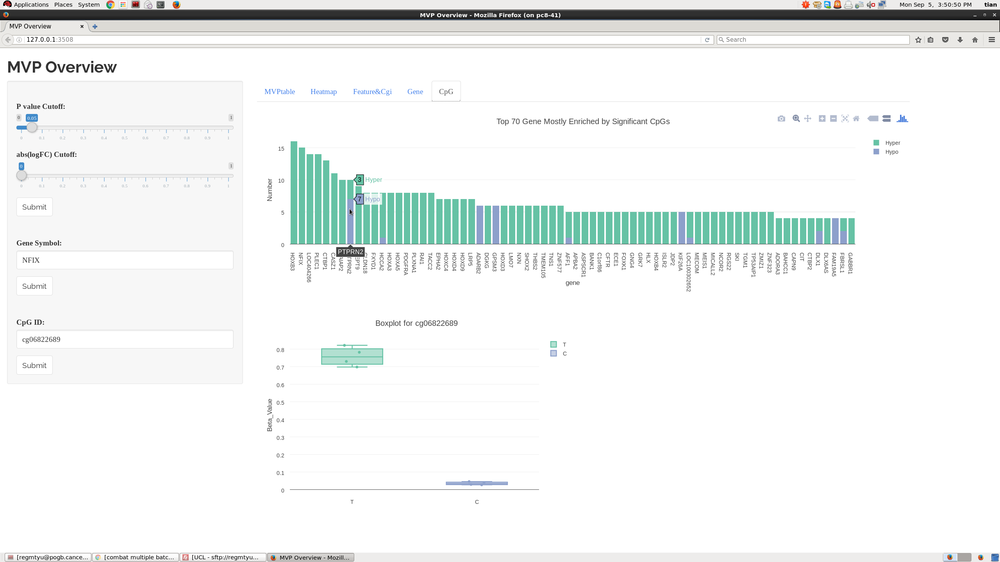

# New Updates

1: **Fixed Error in DMRcate pacakge in cpg.annotate() function: ** DMRcate pacakge get updated for "Error in if (nsig == 0) { : missing value where TRUE/FALSE needed.".

2: **Replace 0 into smallest positive value : ** In champ.load(), instead of replacing all 0 and negative value into 0.0001, we relplace them as smallest positive now, which might result to slightly different from previous result.

3: **Fixed warnings() in all GUI() functions : ** Previously, there are some warnings in GUI() functions, which are merely because we did not assign some parameters in painting, it will NOT cause any error in plot. Based on reviewer's suggestion, in this version pacakge, we fixed most warnings.

4: **More flexible for champ.runCombat() function : ** In previous champ.runCombat() function, we restricted that user can NOT do correction on factors like Sample_Group or Sample_Name. Based on reviewer's suggestion, we removed this restriction in this version,  which means users can fix all covariates by using champ.runCombat() function. Also, we added "variablename" parameter so that user may assign other variables other then "Sample_Group" to be corrected for.

5: **Removed "DMP" parameter in champ.DMR() function : ** Modified ProbeLasso method in champ.DMR() function, there is no need to input "myDMP" anymore, ProbeLasso function would calculate inside the function. Previously, ProbeLasso needs result from champ.DMP() to calculate DMRs, now we have updated it, so that ProbeLasso would calculate DMPs inside champ.DMR() function instead of calling for myDMP parameter.

6: **Changed jpg in champ.CNA() into pdf: ** Previously champ.CNA() generate some jpg figures, now they have been replaced into pdf figures.

# Introduction

The ChAMP package is a pipeline that integrates currently available 450k and EPIC analysis methods and also offers its own novel functionality. It utilises the data import from .idat file and normal beta matrix; Quality Control Plots; SWAN [@Maksimovic12] and Functional Normalization [@Fortin2014] functions offered by the minfi [@minfi] [@Fortin065490] package.

In addition, the ChAMP package includes the Peak Based Correction (PBC) method [@Dedeurwaerder11] and the BMIQ Normalization [@Teschendorff13] is set as the default method.

A number of other pipelines and packages are available for 450k or EPIC array analysis
including IMA [@Wang12IMA], minfi [@minfi], methylumi [@methylumi], RnBeads [@rnbeads] and watermelon [@watermelon]. However, ChAMP provides a comprehensive and compelete analysis pipeline from origin data file to final GSEA result, which would make researchers' work much easier. Also, the new version ChAMP provides a series of Shiny-based WebBrower Interactive analysis function (GUI functions), which should benifit even more scientists' work. 

There are also some other advantages for ChAMP. First of all ChAMP is both available for 450k or EPIC array. Also this package contains multiple novel functions. The singular value decomposition (SVD) method [@Teschendorff09] allows an in-depth look at batch effects and for correction of multiple batch effect the ComBat method [@Johnson07] has been implemented. For the identification of differential methylated regions (DMR) ChAMP offers the new Probe Lasso method [@Butcher201521]. Also another two effective DMR detection function Bumphunter [@Jaffe12] and DMRcate [@Peters2015] is also integrated. Users have more freedom to select their prefered methods.

For the purpose of dealing with cell heterogeneity problem, we included two functions: RefFreeEWAS [@Houseman15052014] and RefbaseEWAS [@Houseman2012] into ChAMP. Finally, ChAMP has an additional function to analyse 450k or EPIC for copy number alterations [@Feber14].

Except new functions, all functions and scripts exist already in old version ChAMP, which all have been enhanced and checked carefully. Also, some new functions are included as well:

For users who need to find methylation Blocks [@Hansen2011]. New version ChAMP includes a function to detect methylation Blocks. Another important function is GSEA, which would take singnificant genes related with DMPs and DMRs and do GSEA analysis, to see what pathways are enriched by significant CpGs or DMRs. To correct biased might be caused by ininequality between genes and CpG probes, we used goseq pacakge to correct the bias [@Young2010]. Also, new version ChAMP incoporates FEM package [@Jiao15082014], which would calculate modules in pathways show differential methylation changes between two phenotypes.

> Apart from that, new version ChAMP provides a [Shiny](http://shiny.rstudio.com/) and [Plotly](https://plot.ly/) based GUI framework, to help scientists to view ChAMP result. This is an interactive WebBrower-based framework, calling for Graph System locally or remotely. **For example X11 for most Linux System.**

**If you have any bug to report, or any suggestions for ChAMP, please email champ450k@gmail.com, or tianyuan1991hit@gmail.com. I will respond you as fast as I can.**

# Installation

It is essential that you have `R 3.3` or above version already installed on your computer. ChAMP is a pipeline that utilises many other Bioconductor packages that are currently available from CRAN and Bioconductor. For all of the steps of the pipeline to work make sure that you have ungraded Bioconductor to newest version (3.3) .

After you have R and Bioconductor installed properly, you can start to install ChAMP. The most easy way to install it is typing following code into **R session**:

```{bash eval=FALSE}
source("https://bioconductor.org/biocLite.R")
biocLite("ChAMP")
```

If you have any problem with traffic with Bioconductor, another option is install **ALL** dependence packages, then install ChAMP. There are a lot if packaged relied by ChAMP. You can use following command in R to install most of them:

```{r eval=FALSE}
source("http://bioconductor.org/biocLite.R")
biocLite(c("minfi","ChAMPdata","Illumina450ProbeVariants.db","sva","IlluminaHumanMethylation450kmanifest","limma","RPMM","DNAcopy","preprocessCore","impute","marray","wateRmelon","goseq","plyr","GenomicRanges","RefFreeEWAS","qvalue","isva","doParallel","bumphunter","quadprog","shiny","shinythemes","plotly","RColorBrewer","DMRcate","dendextend","IlluminaHumanMethylationEPICmanifest","FEM","matrixStats"))
```


>**Note:** ChAMP used plotly to generate interactive plots, at the time ChAMP was firstly developed, plotly was on [3.6.1 version](https://github.com/ropensci/plotly/releases/tag/v3.6.1), which caused some error report in user's GUI function. Now we have made it fully support [version 4.5.6](https://cran.r-project.org/web/packages/plotly/index.html), user may download then use following code **in Bash** to install it, so that the plotly in your system will be upgraded:

```{bash eval=FALSE}
R CMD INSTALL plotly-4.5.6.tar.gz
```

After you did all above work, you may use code below to install ChAMP:
```{bash eval=FALSE}
R CMD INSTALL ChAMP_2.6.0.tar.gz
```
After installation, you may easily load ChAMP package:
```{r eval=TRUE,message=FALSE, warning=FALSE}
library("ChAMP")
```

# Test Data
The package contains two test dataset, one is HumanMethylation450 data (.idat) and the other is **Simulated** EPIC data, which can be used to test functions available in ChAMP. This can be loaded by pointing the directory to the testDataSet like below:

```{r eval=FALSE}
testDir=system.file("extdata",package="ChAMPdata")
myLoad <- champ.load(testDir,arraytype="450K")
```
This dataset contains only 8 Samples, we will use it to show ChAMP functions' usage blow.

For the EPIC Simulation Data Set, user may use following code to load it:

```{r eval=FALSE}
data(EPICSimData)
```
This Simulation Data Set contains 16 samples, all of them are actually originally from one sample but midified into DMP and DMR, also alone with some errors variance.

# ChAMP Pipeline

## Pipeline Introduction
```{r, out.width = 800, fig.retina = NULL,echo=F}
knitr::include_graphics("Figure/ChAMP_Pipeline.png")
```

ChAMP Pipeline Figure above outlines the steps in the ChAMP pipeline. Each step can be run individually as a separate function. This allows integration with other analysis pipelines. In above pipeline plot, all functions of ChAMP are included, which are divided into three colors: 

* **Blue** functions represent functions for Methylation Preparation, like Loading, Normalization, QC check.e.g.
* **Red** functions represent functions for generating analysis results, like DMP(Differential Methylation Probes), DMR(Differential Methylation Regions), Blocks, EpiMod, Pathway Enrichment Result.e.g.
* **Yellow** functions represent GUI interface for Dataset or analysis result.

In above plot, there are some functions and connections(lines) are marked green gleam, which indicate a **Main Analysis Pipeline**. ChAMP combined many functions, but not all of them may be used for a successful analysis. The green gleam represents a main analysis pipeline most likely to be used for various data sets. The black dot in the middle of the plot represents **fully prepared methylation datasets**, which is the milestone between data preparation and data analysis. Thus we suggest you save the fully prepared data since your other analysis would be started from it directly.

## Full Pipeline

The full pipeline can be run at once with one command:

```{r eval=FALSE}
champ.process(directory = testDir)
```

When running the full pipeline through the champ.process() function a number
of parameters can be adjusted. These parameters are related to all functions involved in ChAMP package, but not all parameters are covered, otherwise champ.process() function would be be too large, please check the Manual of ChAMP for parameter settings.

## Separated Steps

Note that champ.process() may not always successfully run, because any small problem on data set in it may result to Error (For example, for some data set I get, the most important covariates in pd file is not "Sample_Group" but "Diagnose"). So if you get any problem in champ.process() you may try separated steps below:

```{r eval=FALSE}
myLoad <- cham.load(testDir)
CpG.GUI()
champ.QC() # Alternatively: QC.GUI()
myNorm <- champ.norm()
champ.SVD()
# If Batch detected, run champ.runCombat() here.
myDMP <- champ.DMP()
DMP.GUI()
myDMR <- champ.DMR()
DMR.GUI()
myBlock <- champ.Block()
Block.GUI()
myGSEA <- champ.GSEA()
myEpiMod <- champ.EpiMod()
myCNA <- champ.CNA()
myRefFree <- champ.reffree()
# If DataSet is Blood samples, run champ.refbase() here.
```
Above are main functions run separately, which contains more parameters to be adjusted and may be integrated with users' other unique analysis tools and method.

## EPIC pipeline
ChAMP provide a friendly user interface for EPIC array analysis, most functions are the same between 450K array and EPIC array, the only difference lies on a parameter `arraytype`, for some functions call for annotation files, you simply need to set parameter arraytype as "EPIC".

In ChAMP package, I created a simulation EPIC data (beta value only, because I can not simulate Red Gree Color intensity information). The pipeline to analysis EPIC array is below:

```{r eval=FALSE}
# myLoad <- champ.load(directory = testDir,arraytype="EPIC")
# We simulated EPIC data from beta value instead of .idat file,
# but user may use above code to read .idat files directly.
# Here we we started with myLoad.

data(EPICSimData)
CpG.GUI(arraytype="EPIC")
champ.QC() # Alternatively QC.GUI(arraytype="EPIC")
myNorm <- champ.norm(arraytype="EPIC")
champ.SVD()
# If Batch detected, run champ.runCombat() here.This data is not suitable.
myDMP <- champ.DMP(arraytype="EPIC")
DMP.GUI()
myDMR <- champ.DMR()
DMR.GUI()
myDMR <- champ.DMR(arraytype="EPIC")
DMR.GUI(arraytype="EPIC")
myBlock <- champ.Block(arraytype="EPIC")
Block.GUI(arraytype="EPIC") # For this simulation data, not Differential Methylation Block is detected.
myGSEA <- champ.GSEA(arraytype="EPIC")
myEpiMod <- champ.EpiMod(arraytype="EPIC")
myRefFree <- champ.reffree()

# champ.CNA(arraytype="EPIC")
# champ.CNA() function call for intensity data, which is not included in our Simulation data.
```

Not that ChAMP incoporates many other functions, not all of them are successfully supporting EPIC array yet. For example, at the time I am writing the vignette, Functional Normalization from minfi package seems not support EPIC array.

## Computational Requirements
The ability to run the pipeline on a large number of samples depends somewhat on the memory available. The ChAMP pipeline runs 200 samples successfully on a computer with 8GB of memory. Beyond this it may be necessary to find a server/cluster to run the analysis on.

The champ.load() function uses the most memory. If you plan to run the analysis more than once it is recommended to to run `myLoad <- champ.load()` and save this list for future analyses.

In champ.DMR(), champ.norm() and champ.Block() functions, some methods may use parallel method to accelerate the speed. If your server or computer has more cores, you may specify more threads at the same time to make function faster, but which may cost more memory. You can use following code in R to detect number of your CpG Cores.

```{r eval=FALSE}
library("doParallel")
detectCores()
```

GUI functions requires more things. A basic framework for a GUI environment is required. If you run ChAMP on your own computer, it should be fine. But if you run ChAMP on a remote server, a local display system is essential to use these WebBrower-based GUI functions. X11 is a very common used tool for this. For Windows remote users, Xmanager is an excellent choice.

> A significant improvement for new version ChAMP is that: User can also conduct full analysis even if they are not started from .idat file. As long as you have a methylation beta matrix and corresponding Phenotypes pd file, you can conduct all ChAMP analysis. It should be much more easier for user get data from TCGA or GEO, but without original .idat file.


# Description of ChAMP Pipelines

As previously mentioned, the user has the option to run each of the ChAMP functions individually to allow integration with other pipelines or to save the results of each step. Here each function is described in detail.

## Loading Data

Loading Data is first step for all analysis. ChAMP provides a loading function to get data from .idat file (with pd file (Sample_Sheet.csv) in it). The champ.load() function utilises minfi to load data from .idat files. By default this loads data from the current working directory, in this directory you should have all .idat files and a sample sheet. The sample sheet currently needs to be a .csv file as came with your results following hybridization. You can choose whether you want M-values or beta-values. For small datasets M-values are recommended [@Zhuang12]. The minfi function used to load the data from the idat files would automatically filters out the SNPs that might influent the analyais result. The SNP list are generated from [Zhou's Nucleic Acids Research paper in 2016](http://zwdzwd.github.io/InfiniumAnnotation) [@Zhou2016], which is designed specifically for 450K and EPIC, also with population difference considered. As such, for 450k bead array data, before filtering for low quality probes, the dataset will include 485,512 probes. And for EPIC bead array data, before filtering probes the dataset, will include 867,531 probes.

User may use following code to load data set:
```{r eval=FALSE}
myLoad <- champ.load(testDir)
## We are not running this code here because it cost about 1 minute.
```
To save user's time to open this vignette, we already saved loaded dataset into `testDataSet` in ChAMPdata package, you can use following code to load it:

```{r eval=TRUE}
data(testDataSet)
```

Now we can check the pd file (Sample_Sheet.csv), because it's very important. Most pd files are similar but not all of them are exactly the same. So user **MUST** understand their pd file perfectly to achieve a successfully analysis.
```{r eval=TRUE}
myLoad$pd
```
As we can see here, the Sample_Group contains two phenotypes: C and T, which is what we want to compare.

During the loading process, champ.load() function would also do some filtering.

* First filter is for probes with detection p-value (< 0.01). This utilises minfi method for calculating the detection p-value which differs from the method used in Genome Studio. A failedSamples result will be printed to the screen showing the fraction of failed probes per sample. If any of these values is high (>0.05) you may want to consider removing that sample from the analysis and rerun it. Previously we found that in many cases, only one or two samples in a big data set are not qualited for analysis, and they may have 70% or even 80% of failed probes. If we only do filtering on probes, about 80% of probes will be masked, so we developed new filtering system on both sample and probe. If certain sample's failed probes' ratio if above certain threshold (default = 0.1), then this sample will be discarded, then filtering to probes will be carried on rest samples. The threshold of sample and probe can be controled by parameter detSamplecut and detPcut separately.
* Second, ChAMP will filter out probes with <3 beads in at least 5% of samples per probe. This default can changed with the filterBeads parameter or the frequency can be adjusted with the beadCutoff parameter.
* Third, ChAMP will filter out all None-CpG probes contained in your dataset.
* Fourth, ChAMP will filter all SNP-related probes. The SNP list comes from [Zhou's Nucleic Acids Research paper in 2016](http://zwdzwd.github.io/InfiniumAnnotation).
* Fifth, ChAMP will filter all multi-hit probes. The multi-hit probe list comes from [Nordlund's Genome Biology Paper in 2013](https://genomebiology.biomedcentral.com/articles/10.1186/gb-2013-14-9-r105)[@Nordlund2013].
* And the Sixth, ChAMP will filter out all probes located in chromosome X and Y.

All above filtering are controled by parameters in champ.load() function, user may adjust as you wish. Note that, Though most ChAMP functions are supporting isolated beta matrix analysis, which means not relying on .idat file from beginning, **but champ.load() can not do filtering on beta matrix alone. For users have nothing but beta matrix and Sample_Sheet.csv, you may do filtering with newly champ.filter() function and then use following functions to do analysis.**

Beside this, we provide a small function CpG.GUI() for user to check their distribution of CpGs. This function can be used for any CpGs list, for example, during your analysis, whenever you get a significant CpG list from DMR, you can user following function to check the distribution of your CpG vector:

```{r eval=FALSE}
CpG.GUI(CpG=rownames(myLoad$beta),arraytype="450K")
```
```{r, out.width = 800, fig.retina = NULL,echo=F}
knitr::include_graphics("Figure/CpGGUI.png")
```

This is a very easy function to demonstrate the distribution of your CpG list.

## Quality Check
Quality Checking is an important process to make sure dataset is suitable to analysis. champ.QC() function and QC.GUI() function would draw some plots for user to easily check their data's quality. Merely there are three plot would be generated:

```{r eval=TRUE,dpi=100,fig.width=7,fig.height=4,message=FALSE}
champ.QC()
```

* mdsPlot (Multidimensional Scaling Plot): This plot allows a visualization of the similarity of samples based on the top 1000 most variable probes amongst all samples. The samples are colored by Sample Groups.
* densityPlot: The beta distribution line for each sample, user may use this figure to find samples not very good (maybe with too many probes deleted during loading process.)
* dendrogram: The clustering plot for all samples, you may select different method to generat this plot. There is a parameter `Feature.sel="None"` in champ.QC() function. While "None" means the distance between samples would be calculated directly by all probe, "SVD" means function would use SVD to deconvolute matrix then select significant components. Then the distance between samples would be calculated based on these components.

Or you may use QC.GUI() function as below, which may cost more memory, thus make sure you have a good server or computer when you run this all GUI function in ChAMP.
```{r eval=FALSE}
CpG.GUI(CpG=rownames(myLoad$beta),arraytype="450K")
```
```{r, out.width = 800, fig.retina = NULL,echo=FALSE}
knitr::include_graphics("Figure/QCGUI.jpg")
```
Different from champ.QC(), QC.GUI() will provide five interactive plot. mdsPlot, type-I&II densityPlot, Sample beta distribution plot, dendrogram plot and top 1000 variable CpG's heatmap. User may easily interactive with these plot to see if your sample are qualited for further analysis, and check clustering result and top CpGs.

* Pobe-Type-I&II plot: the beta distribution of Type-I and Type-II probes in your dataset, which could help you to check your data set's normalization status.
* Top variable CpG heatmap: This heatmap would select most variable CpGs, and do heatmap on them.

## Normalization

Normalization is an essential step for data preparation. The type-I and type-II probes in one data set share different beta distributions, thus they may cause problem in DMP or DMR detection. Here you can use champ.norm() function to eliminate effect of two Type probes.

In champ.norm(), we provides **four methods** to do normalization. BMIQ [@Teschendorff13], SWAN [@Maksimovic12], PBC [@Dedeurwaerder11] and FunctionalNormliazation [@Fortin2014]. There are some different between each method, user may read related paper to select one.

Until the time I am writing this vignette. FunctionalNormliazation can only support 450K, SWAN call for mset data and rgSet, FunctionalNormliazation call for rgSet, which means, FunctionalNormliazation and SWAN merely only works for .idat file users. 

Not that BMIQ function has been updated to version 1.6, which would provide better normalization result for EPIC array. Some scientists may encounter error when using BMIQ on certain samples, merely because these samples' quality are really bad that they are not even beta distribution any more. Also BMIQ function now can be run in parallel, if your computer has more than one core, you may set parameter "cores" in function to accelerate the function. If you set parameter `PDFplot=TRUE`, the plot for BMIQ function would be saved in `resultsDir`.

The code to do Normalization is below:
```{r eval=FALSE}
myNorm <- champ.norm(beta=myLoad$beta,arraytype="450K",cores=5)
```
Below is the one result of BMIQ function:
```{r, out.width = 800, fig.retina = NULL,echo=FALSE}

```
After Normalization, you may use QC.GUI() function to check the result again.

## SVD Plot
The singular value decomposition method (SVD) implemented by Teschendorff [@Teschendorff09] for methylation data is used to identify the most significant components of variation. These components of variation would ideally be biological factors of interest, but it may be technical variation (batch effects) as well. To get the most from this analysis it is useful to include as much information as possible.

If samples have been loaded from .idat files then the 18 internal controls on the bead chip (including bisulphite conversion efficiency) will be included if you set parameter `RGEffect=TRUE` in champ.SVD() function. Also compared with old version of package, current version of champ.SVD() would detect all valid factors to analysis, which means plot contain two following conditions:

* Covariates are not related with name, Sample_Name, file_Name .e.g.
* Covariates are contain at least two different values.

champ.SVD() function would detect all valid covariates in your pd file. Thus you have some unique covariates want to be analyed, you may combine them into your pd file, champ.SVD() would analysis together.

Note that, for different type of covariates (categorical and numeric) covariates, champ.SVD() would used different ways (Krustal.Test and Linear Regression) to calculate the significance between covariates and components. Thus please make sure your pd is an data frame and numeric covariates are transfered into "numeric" type, while categorical covariates are transfered into "factor" or "character" type.

During champ.SVD() running, all detected covariates will be printed on screen, so that user may check if covariates you want to analysis are correct.

The result is a heatmap (saved as SVDsummary.pdf) of the top 6 principle components correlated to the covariates information provided. The darker colours represent a lower p-value, indicating a larger component of variation. If it becomes clear from this SVD analysis that the largest components of variation are technical factors (batch effects) then it is worth considering the experimental design and implementing other normalization methods that may help remove technical variation. ComBat is included in this pipeline to remove variation related to chip number but it or other methods may be implemented independently to remove other sources of technical variation revealed in the SVD analysis.

You may use following code to generate SVD plot:
```{r eval=TRUE,dpi=100,fig.width=8,fig.height=8,message=FALSE,warning=FALSE}
champ.SVD(beta=myNorm,pd=myLoad$pd)
```

## Batch Effect Correction

This function implements the ComBat normalization method [@Johnson07] that was developed for microarrays. The sva R package is used to implement this function. ComBat is specifically defined in the ChAMP package to correct for batch effects. More advanced users can implement ComBat using sva documentation to adjust for other batch effects.

This version of champ.runCombat() is coded for more than one batch effect, but only one batch is suggested. You need to set parameter `batchname=c("Slides","Array")` in the function to correct them.

> Note that champ.runCombat() would extract batch from your batchname, so please make sure you understand you dataset perfectly. **Another important thing is, champ.runCombat() would automatically assume "Sample_Group" is the covariates need to be analysed**, thus for some data set whose disease phenotype is NOT Sample_Group, please assign Sample_Group as the covariate name. 

ComBat algorithsm uses an empirical Bayes method to correct for technical variation. If ComBat were applied directly to beta values zeros could be introduced as beta values have a range between 0 and 1. For this reason ChAMP logit transforms beta values before ComBat adjustment and then computes the reverse logit transformation following the ComBat adjustment. If the user has chosen to use M-values, please assign `logitTrans=FALSE`. 

During the function champ.runCombat(), the program would automatically detect all valid factors might be corrected and list on screen, so that user may check if there are the batches you want to correct. Then if the batchname assigned by user are correct, the function would started to do batch correction.

You can use following code to do batch correction:
```{r eval=FALSE}
myCombat <- champ.runCombat(beta=myNorm,pd=myLoad$pd,batchname=c("Slide"))
```
> **The ComBat function could be a very time consuming step in the pipeline if you have a large number of samples.** After the correction, you may use champ.SVD() function to check the corrected result.

## Differential Methylation Probes

Differential Methylation Probes (DMP) is most commonly analysed result for methylation research. Here user may use champ.DMP() function to calculate differential methylation probes. And use DMP.GUI() to check the result.

champ.DMP() function implements the limma package to calculate the p-value for differential methylation using a linear model. At present, the function can only compute differential methylation between two groups. The two groups are determined by the Sample Group column in the sample sheet. If more than two groups are present the function will calculate the differential methylation between the first two unique groups in the file. As the function is running it will print which two groups the contrast is being computed for and will then print out how many DMPs were found for the given p-value.

The result of champ.DMP() included the p value, t value logFC between two groups, also includes the annotation for each probe, the average beta (for the sample group) and the delta beta value for the two groups used in the comparison. It is planned that a future version of ChAMP will include the ability to compare multiple groups. However, a more advanced user can run limma with other settings and use the output (including all probes and their p-values) for the DMR hunter.

User may use following code to get DMPs:
```{r eval=TRUE,warning=FALSE,message=FALSE}
myDMP <- champ.DMP(beta = myNorm,pheno=myLoad$pd$Sample_Group)
```

We can check the result of champ.DMP() as below:
```{r eval=TRUE}
head(myDMP)
```

In this version of ChAMP, we included a nice GUI interface for user to check the result of `myDMP` generated from above code. You just need to provide the "unmodified" result of champ.DMP (myDMP), orginal beta matrix you used to generat DMP (beta) and covariates you want to analysis. You can used following code to open DMP.GUI() function. 

> Note that your myDMP reuslt may only be calcuated from two phenotypes, but your covariates may contain 3 or even more phenotypes.

```{r eval=FALSE}
DMP.GUI(DMP=myDMP,beta=myNorm,pheno=myLoad$pd$Sample_Group)
```
```{r, out.width = 800, fig.retina = NULL,echo=FALSE}
knitr::include_graphics("Figure/DMP-1.png")
```
The left panel indicate the cut off parameters for significant CpGs. Currently only two parameters are supported here: p value and abs(logFC). User may set these two values then press "Submit" to generate significant CpGs table on the right. On the right is the table of significant CpGs, all information are included, the table can be ranked by each column.


```{r, out.width = 800, fig.retina = NULL,echo=FALSE}
knitr::include_graphics("Figure/DMP-2.png")
```
The second tab provide the heatmap of ALL significant CpGs you generate by left panel cutoff.


```{r, out.width = 800, fig.retina = NULL,echo=FALSE}
knitr::include_graphics("Figure/DMP-3.png")
```
The third panel provide the barplot of **proportion** of each CpG feature and cgi summary information for hyper and hypo CpGs. **You may press the marker in the legend to close or open certain bars.**

```{r, out.width = 800, fig.retina = NULL,echo=FALSE}
knitr::include_graphics("Figure/DMP-4.png")
```
The fourth tab is controled by the gene parameter on the left panel. You may select an gene name (the example default is NFIX here) and press "submit". Then the plot for this gene will be plot above. Note that the x axis here is not the actual MAPINFO of each CpG. The distance between each CpG are the same. There are two kinds of lines plotted for each phenotype, the solid lines represent Mean Value plot, and the dash line represent the Loess line, **user may close or open they by clicking the marker on the legend**. Below is the feature and cgi information of each CpG. At the bottom of this tab, is the gene information extracted from wikigene, which is also controled by the gene parameter on the left.


```{r, out.width = 800, fig.retina = NULL,echo=FALSE}

```
The fifth tab included two plots. At the top is the enrichment plot for top 70 genes involved in significant CpGs you select by left cutoff parameters. The number in each bar indicate how many hyper or hypo differential methylated CpGs are included in this gene. User may use this plot to find intereted genes then use tab 4 to plot the gene. At the bottom of this tab, is the boxplot of certain CpGs, which is controled by parameter on the left panel.

> **Note that all plots here can be Zoomed in or out. And can be downloaded directly. You may even change the shape of the brower to change the size of plot then download it with different resolution.**

## Differential Methylation Regions

Differentially methylated regions (DMRs) are extended and discreet segments of the genome that show a quantitative alteration in DNA methylation levels between two groups. champ.DMR() is the function ChAMP provides to computes and returns a data frame of probes binned into discreet differentially methylated regions (DMRs), with accompanying p-value.

There are three algotithms integrated to do this job, Bumphunter, ProbeLasso and DMRcate. For Bumphunter algotithms, it would firstly cluster all probes into small clusters, then apply random permulation method to estimate candidate DMRs. This method is very user friendly and is not relying on any output of previous functions. The permulation steps in Bumphunter algotithms may be a little bit slow, but user may assign more core to accelerate it by parallel more threads. The result of bumphunter algotithm is a dataframe contain all detected DMRs, with their length, clusters, number of CpGs.e.g annotated.

For ProbeLasso method, the final data frame is distilled from a limma output of probes and their association statistics, so the result from champ.DMP() MUST be inputted into champ.DMR() function. For the principle and mechanism of ProbeLasso function, user may find it in original paper [@Butcher201521].

The new method here incoporated in new version ChAMP is DMRcate. This is a data-driven approach that is agnostic to all annotations except for spatial ones, specifically chromosomal coordinates. Critical to DMRcate are robust estimates of differential methylation (DM) at individual CpG sites derived from limma, arguably the most widely used tool for microarray analysis. DMRcate pass the square of the moderated t statistic calculated on each 450K probe to DMR-finding function. Then DMRcate would apply a Gaussian kernel to smooth this metric within a given window, and also derive an expected value of the smoothed estimate (in other words, one with no experimental effect) from the varying density of CpGs sites incurred by reduced representation and irregular spacing. For more detail about DMRcate function, user may read the original paper [$Peters2015] and DMRcate R pacakge.

User may use following code to generate DMR:
```{r eval=FALSE,message=FALSE,warning=TRUE}
myDMR <- champ.DMR(beta=myNorm,pheno=myLoad$pd$Sample_Group,method="Bumphunter")
```
The result of Bumphunter, DMRcate and ProbeLasso functions are all dataframe, but main contain different columns. Here we can have a check on DMRcate result.
```{r eval=TRUE}
head(myDMR$DMRcateDMR)
```
Just like DMP result, we provide `DMR.GUI()` as interface for DMR result. All result from three different method of champ.DMR() are supported in the GUI function. The DMR.GUI() function would automatically detected what kind of input the DMR result is. **Thus it's not recommended to modify the structure of `myDMR` result.**
```{r eval=FALSE}
DMR.GUI(DMR=myDMR)
# It might be a little bit slow to open DMR.GUI() because function need to extract annotation for CpGs from DMR. Might take 30 seconds.
```

```{r, out.width = 800, fig.retina = NULL,echo=FALSE}
knitr::include_graphics("Figure/DMR-1.png")
```
Just like the DMP.GUI above, there is a panel for parameters on the left, user may set the parameters to select significant DMRs. We currently only provide two parameters: p value and min number probes. The above title will indicate the method you used to get DMR (here is DMRcate). **Note that for different method the p value may indicate different columns. Bumphunter is `pvaluearea`, while ProbeLasso is `dmrP`, and there is no cutoff for DMRcate result, which has been done during calculation.** After your selection and press "Submit", you will get table of significant DMRs on the right. For different method, the table content might be different. Thus user should research what method you want to use to find DMRs.

```{r, out.width = 800, fig.retina = NULL,echo=FALSE}
knitr::include_graphics("Figure/DMR-2.png")
```
The second tab provides a table for all CpGs involvded in these DMRs, which can be regarded as a mapping list between CpGs and DMRs. Also if you can not get gene information in first tab, you can get them here. In this table, for each CpGs, their corresponding genes and DMRs are marked.

```{r, out.width = 800, fig.retina = NULL,echo=FALSE}
knitr::include_graphics("Figure/DMR-3.png")
```
The third plot is the plot of each DMR, just like the gene plot in DMP.GUI() function. Here the x axis are not real MAPINFO of each CpG, the distance between each CpGs are equal. Also I have feature and CpGs marked under the plot. At the top of this tab, are the table of all CpGs in this DMR. You can use the DMR index parameter on the left panel to select DMR you want to check.

```{r, out.width = 800, fig.retina = NULL,echo=FALSE}
knitr::include_graphics("Figure/DMR-4.png")
```
The fourth tab provide the enrichment information of genes and heatmap. Note that there might be many genes and CpGs in this plot. So if you have too many DMRs selected, the plot might be too big to be open. But you don't need to worry can not see it clearly, because you may zoom in as much as you can to check details.

## Differential Methylation Blocks

In recent years, there are more researchs about Differential Methylation Blocks [@Hansen2011]. Here we provides a function to calculate methylation blocks. In our Block-finder function, champ.Block() would firstly calculate small clusters (regions) on whole genome based on their locations on genome. Then for each cluster (region), the mean value and mean position would be calcuated, thus you can assume that each region would be collapsed into a dot. Then Bumphunter algorithsm will be used to find "DMRs" over these regions (dots after collapse). **Note that only open sea regions will be used to calculate Blocks**. In our previous paper [@Yuan2015] we demonstrated that Differential Methylation Blocks may show universal feature across various cancers.

User may use following code to generate methylation blocks:
```{r eval=FALSE}
myBlock <- champ.Block(beta=myNorm,pheno=myLoad$pd$Sample_Group,arraytype="450K")
```
A lot of things would be returned by champ.Block() function, but the most important is the first list: Block. You may check it like below:
```{r eval=TRUE}
head(myBlock$Block)
```
And we provides a GUI function for user to check the result of `myBlock` above.
```{r eval=FALSE}
Block.GUI(Block=myBlock,beta=myNorm,pheno=myLoad$pd$Sample_Group,runDMP=TRUE,compare.group=NULL,arraytype="450K")
```
Note that there are two special parameters here: `runDMP` means if Block.GUI() function should calculate DMP for each CpGs, if not, the GUI() function would only return the annotation of all involvded CpGs. And just like champ.DMP() function, compare.group need to be assigned if you want to calculate DMP while running Block.GUI().


```{r, out.width = 800, fig.retina = NULL,echo=FALSE}
knitr::include_graphics("Figure/Block-1.png")
```
Just like DMP.GUI() and DMR.GUI(), the p value cutoff and min cluster (similar to min probes in DMR.GUI()) controls the number of significant Blocks you selected. Then the information of significant blocks will be listed on the right.

```{r, out.width = 800, fig.retina = NULL,echo=FALSE}
knitr::include_graphics("Figure/Block-2.png")
```
The second tab provides information of all CpGs involved in all Blocks. For methylation blocks, there are actually three unit: Block, Cluster (regions) and CpG. Blocks are formed by some clusters, and clusters are formed by some CpGs. Thus the second tab actually provides a mapping solution from CpG to Block. User may use this tab to find their interested genes and CpGs. Then use DMP.GUI() to combind research between Blocks and DMPs.

```{r, out.width = 800, fig.retina = NULL,echo=FALSE}
knitr::include_graphics("Figure/Block-3.png")
```
The third tab provides the plot for each Blocks. **Be caution that each Block may contain many many clusters. Thus it would be slow to calculate and plot. And please make sure you have a good computer or server to run this function.** Note that plot is slightly different from DMR.GUI() and DMP.GUI() that the x axis is actually the **REAL** MAPINFO of each cluster, because I also need to map CpG islands position above the lines (Those dark red dots).

## Gene Set Enrichment Analysis
Gene Set Enrichment Analysis is an very important step for most Bioinformatics work. After previous steps, you may already get some significant DMPs or DMRs, thus you may want to know if genes involvded in these significant DMPs or DMRs are actually corresponding to some pathways. To achieve this analysis, you can use champ.GSEA() to do GSEA analysis. 

champ.GSEA() would automatically extract genes in `myDMP` and `myDMR` (No matter what method you have used to generate DMRs). Also if you have your own significant CpG list or gene list calculated from **THE SAME** methylation arrays (450K or EPIC) by other method not included in ChAMP. You may also format them into **list** and input the function to do GSEA. champ.GSEA() would automatically extract gene information, transfer CpG information into gene information then conduct GSEA on each list. During the mapping process between CpGs to genes, if there are multiple CpGs mapped to one gene, that gene would only be counted once in case of over counting.

There are two ways to do GSEA. In previous version, ChAMP used pathway information downloaded from [MSigDB](http://software.broadinstitute.org/gsea/msigdb/index.jsp). Then **Fisher Exact Test ** will be used to calculate the enrichment status of each pathway. After gene enrichment analysis, champ.GSEA() function would automatically return pathway with p value smaller then adjPval cutoff.

For most situation, above fisher exact test method should works fine. However, as the [Geeleher's Paper](http://bioinformatics.oxfordjournals.org/content/early/2013/06/24/bioinformatics.btt311.full) addressed. Since different genes has different numbers of CpGs contained inside, the two situation that one genes with 50 CpGs inside but only one of them show significant methylation, and one gene with 2 CpGs inside but two are significant methylated should not be eaqualy treated. The solution is use number of CpGs contained by genes to correct significant genes. Here we used [goseq](http://bioconductor.org/packages/release/bioc/html/goseq.html) package [@Young2010] to solve this problem. This package was originally designed to correct bias caused by gene's length during GSEA procedure. Here we used number of CpGs contained by each gene replace length as biased data, to correct this issue.

> Note: If user want to correct the biased caused between genes' number and CpGs' number, they may set **method** parameter in champ.GSEA() function as "goseq" to use goseq method to do GSEA, or user may set it as "fisher" to do normal Gene Set Enrichment Analysis.

User may use following command to do GSEA:
```{r eval=FALSE}
myGSEA <- champ.GSEA(beta=myNorm,DMP=myDMP,DMR=myDMR,arraytype="450K",adjPval=0.05)
# myDMP and myDMR could (not must) be used directly.
```
After the calculation, for each list (DMP,DMR or other list), one GSEA result would be returned. User may check the result like below:

```{r eval=TRUE}
head(myGSEA$DMP)
# Above is the GSEA result for differential methylation probes.
head(myGSEA$DMR)
# Above is the GSEA result for differential methylation regions.
# Too many information may be printed, so we are not going to show the result here.
```
##Differential Methylation Interactive Hotspots

Another function included in ChAMP is champ.EpiMod(). This function uses [FEM package](https://www.bioconductor.org/packages/devel/bioc/html/FEM.html) to calcuate the Interactive Hotspots in modules for certain data set. By "interactome hotspot" we mean a connected subnetwork of the protein interaction network (PIN) with an exceptionally large average edge-weight density in relation to the rest of the network. The weight edges are constructed from the statistics of association of DNA methylation. Thus, the champ.EpiMod() function can be viewed as a functional supervised algorithm, which uses a network of relations between genes (in our case a PPI network), to identify subnetworks where a significant number of genes are associated with a phenotype of interest (POI).

Thus compared with GSEA and other pathway detection method, champ.EpiMod() (or FEM package) used more strict way to estimate small modules located in big pathways. Each edge and genes' status would be calculated based on the data set you inputted. Orginally, FEM package was developed to do interactive analysis between methylation data and RNA expression data, which could get modules show both Differential Methylation and Differential Expression status. **However here we only provide usage to calcuated module show differential methylation.** More advanced user may refer to FEM package for more information.

User may use following code to do champ.EpiMod()
```{r eval=FALSE}
myEpiMod <- champ.EpiMod(beta=myNorm,pheno=myLoad$pd$Sample_Group)
```
The all significant modules would be returned. And PDF version plots would returned in resultsDir in function parameter. Like below:

```{r, out.width = 800, fig.retina = NULL,echo=FALSE}
knitr::include_graphics("Figure/EpiMod.jpg")
```
Above we demonstrated four modules detect by champ.EpiMod() based on our small 450K test data. But in practic, each modules would be saved in to a pdf file individually in resultsDir directory.

##Copy Number Various

For Copy Number Various analysis, we provide champ.CNA() to achieve this work. This function uses the HumanMethylation450 or HumanMethylationEPIC data to identify copy number alterations [@Feber14]. The function utilises the intensity values for each probe to count copy number and determine if copy number alterations are present. Copy number is determined using the CopyNumber package.

Basically there are two methody you may choose to do CNA analysis: you may compare the copy number various between case samples and control samples; or you can compare copy number of each sample to the average copy number status of all samples. For the first method, you may specify which groups of samples in your pheno parameter, or ChAMP already included some blood control samples itself, you may use them as control then calculate the copy number variance, all you need to do is assign parameter `control=TRUE` and `controlGroup="champCtls"`. For the other method, you may assign `control=FALSE` to apply.

There are two kinds of plots would be generated, analysis for each sample (`sampleCNA=TRUE` parameter) and analysis for each group (`groupFreqPlots=TRUE` parameter). Like champ.QC() function before, there are two parameter could be assigned for plots. The Rplot parameter would control if champ.CNA() would plot with R session, and PDFplot parameter would control if champ.CNA() would save PDF file to resultsDir. By default, only PDFplot is TRUE.

> Note that different from old version of ChAMP. **No batch correction would be run automatically on intensity data**, if you want to correct batch effect on intensity data, please use champ.runCombat(), the usage for intensity data is exactly the same for beta or M matrix, the only difference is you need to replace the beta value with `myLoad$intensity` and set `logitTrans=FALSE`.

Feber [@Feber14] compared the results obtained using this method to copy number data from Illumina CytoSNP array and Affymetrix SNP 6.0 arrays and found that using this method for 450k data was effective in identifying regions of gain and loss.

Users may use following code to calculate Copy Number Variance:
```{r eval=FALSE}
myCNA <- champ.CNA(intensity=myLoad$intensity,pheno=myLoad$pd$Sample_Group)
```

The main usage of champ.CNA() function is to generate plot for sample and groups in pheno. Like below:

```{r, out.width = 800, fig.retina = NULL,echo=FALSE}
knitr::include_graphics("Figure/CNAGroupPlot.jpg")
```

## Cell Heterogeneity

While many methylation sample are collected from whole blood, their methylation status actually are combination of various cell types. These cell-type specified methylation may cover ture epigenome signals as well as true relationships between CpGs sites and phenotypes, or themsleves are the reason of some diseases. Thus many methods have be invented to deal with cell heterogeneity problem, like RefbaseEWAS and RefFreeEWAS incoporated

RefbaseEWAS method is a method similar to regression calibration, for inferring changes in the distribution of white blood cells between different subpopulations (e.g. cases and controls) using DNA methylation signatures, in combination with a previously obtained external validation set consisting of signatures from purified leukocyte samples.

We integrates another cell type heterogeneity correction method RefFreeEWAS in ChAMP. The new RefFreeEWAS method is similar to non-negative matrix factorization, with additional constraints and additional utilities. This function is specifically suitable for tissue datasets such as placenta, saliva, adipose or tumor tissue. This method closely related to surrogate variable analysis, relies on a simple projection based on singular value decomposition (SVD), as does SVA. In SVA, the residuals of a linear model are decomposed into a factor-analytic structure and the factors are used subsequently in a regression model, with iteration resulting in a final set of surrogate variables.

Here we prepared two cell-type purified methylation reference, one for 27K and the other for 450K, user may use any of them to do cell heterogeneity to correct heterogeneity based on cell propotions of each sample. However, though RefbaseEWAS method would return fairly accurate cell propotion, this method can ONLY be applied for whole blood samples, which contain cells in the reference. After champ.refbase() function, cell type heterogeneity corrected beta matrix, and cell-type specific propotions in each sample will be returned.

On the other hand, RefFreeEWAS method requires two parameters in champ.reffree() function, one is the covariates matrix for inputted dataset, which could be a matrix or a vector. containing various phenotypes of each sample. The other important parameter is number of latent variable K, which represent numbers of latent cell type mixed in the dataset. If users don't know the correct number of latent variable (cell types), they could ignore this parameter, and champ.reffree() will apply Random Matrix Theory from isva package to estimate number of latent variables.

User may use following code to do cell heterogeneity analysis:
```{r eval=FALSE}
myRefFree <- champ.reffree(beta=myNorm,pheno=myLoad$pd$Sample_Group)
```
Then we can see the q value calculated for each CpGs, user may relying on the q value below to select significant CpGs after cell heterogeneity correction:
```{r eval=TRUE}
head(myRefFree$qvBeta)
```
For RefbaseEWAS method, user could get cell propotion of each sample by champ.refbase(). But do remember **champ.refbase() can only works on Blood Sample Data Set.**

```{r eval=FALSE}
myRefBase <- champ.refbase(beta=myNorm,arraytype="450K")
# Our test data set is not blood.
```

# Summary

Above are all pipeline and functions included in ChAMP. It's a totally new version can different from old one, we hope to provide you most convenient and fast methylation analysis pipeline for 450K and EPIC array. It's a very comprehensive package with thousands of lines of code, we already made our best to make sure it's correct and fast.

In the future we may make it better and faster, along with more functions and usages. If you have question,bug report, suggestion for ChAMP, please email to champ450k@gmail.com.


# Citing ChAMP

ChAMP is implemented by incoporated many other very talented scientists' work. Some functions are achieved by adopting other packages, while some functions are coded by ChAMP's author but with ideas and theories provided by other works. So when you are using functions provided by ChAMP, please citate other scientists's work correctly, so that people who invented these theory and method would get corresponding credits and honor.

If you want to citate ChAMP package itself, please add following papers in your article. This article is about ChAMP, an integrated analysis pipeline for DNA methylation analysis:

> Morris, T. J., Butcher, L. M., Feber, A., Teschendorff, A. E., Chakravarthy, A. R., Wojdacz, T. K., and Beck, S. (2014). Champ: 450k chip analysis methylation pipeline pg - 428-30. Bioinformatics, 30(3), 428-30.

The loading part of ChAMP (champ.load) used minfi package, so does FunctionalNormliazation, SWAN normalization methods. If you want used above two normalization methods, you may want to citate below minfi paper:

> Aryee MJ, Jaffe AE, Corrada-Bravo H, Ladd-Acosta C, Feinberg AP, Hansen KD and Irizarry RA (2014). Minfi: A flexible and comprehensive Bioconductor package for the analysis of Infinium DNA Methylation microarrays. Bioinformatics, 30(10), pp. 1363-1369. doi: 10.1093/bioinformatics/btu049.

> Jean-Philippe Fortin, Timothy Triche, Kasper Hansen. Preprocessing, normalization and integration of the Illumina HumanMethylationEPIC array. bioRxiv 065490; doi: https://doi.org/10.1101/065490

Note that during filtering step, we used below paper's SNP list, which included SNP located 5 bp close to CpG sites, with global MAF >1%, and other characters. For more information about SNP being filtered, you may check below paper:

> Zhou W, Laird PW and Shen H: Comprehensive characterization, annotation and innovative use of Infinium DNA Methylation BeadChip probes. Nucleic Acids Research 2016

The default normalization method in ChAMP is BMIQ, which is invented by Andrew Teschendorff. This is a very popular and well-designed normalization function, you may citate below paper:

> Teschendorff AE et al . A beta-mixture quantile normalization method for correcting probe design bias in illumina infinium 450 k dna methylation data. Bioinformatics. 2013;29(2):189-196.

Another included normalization method is PBC, the related paper is below:

> Dedeurwaerder S et a. Evaluation of the infinium methylation 450K technology. Epigenomics. 2011;3(6):771-784.

champ.SVD() function is a very good option to detect effect of factors on dataset. The paper related with this function is below:

> Teschendorff AE et a. An epigenetic signature in peripheral blood predicts active ovarian cancer. PLoS One. 2009;4(12):e8274.

ChAMP used famous batch correction method Combat from `SVA` package for batch correction. You may citate Combat-related paper below:

> Johnson WE et a. Adjusting batch effects in microarray expression data using empirical bayes methods. Biostatistics. 2007;8(1):118-127.

Above are all functions related to **Data Preparation**. Below are functions and methods related to statistic result estimation.

In ChAMP we used [limma](https://bioconductor.org/packages/release/bioc/html/limma.html) to find DMP. According to [user guild of limma](http://159.226.251.230/videoplayer/usersguide.pdf?ich_u_r_i=8289d05ee30461a0bfa23671c3ba865d&ich_s_t_a_r_t=0&ich_e_n_d=0&ich_k_e_y=1645128926750463352442&ich_t_y_p_e=1&ich_d_i_s_k_i_d=6&ich_u_n_i_t=1), research related to differential analysis should citate some specific paper. Below are two papers user may want to use:

> Ritchie, ME, Phipson, B, Wu, D, Hu, Y, Law, CW, Shi, W, and Smyth, GK (2015).
limma powers differential expression analyses for RNA-sequencing and microarray studies. Nucleic Acids Research 43(7), e47

> Phipson, B, Lee, S, Majewski, IJ, Alexander, WS, and Smyth, GK (2016). Robust hyperparameter estimation protects against hypervariable genes and improves power to detect differential expression. Annals of Applied Statistics 10(2), 946-963.

When it comes to DMR detection, here there are three method incoporated: If you used Bumphunter method, you may use this one:

> Jaffe AE et a. Bump hunting to identify differentially methylated regions in epigenetic epidemiology studies. Int J Epidemiol. 2012;41(1):200-209.

If you used ProbeLasso function, you may use this one:

> Butcher LM, Beck S. Probe lasso: A novel method to rope in differentially methylated regions with 450K dna methylation data. Methods. 2015;72:21-28.

Or if you used [DMRcate](https://bioconductor.org/packages/release/bioc/html/DMRcate.html) function invented by Tim Peters, you may use paper below:

> Peters TJ, Buckley MJ, Statham AL, et al. De novo identification of differentially methylated regions in the human genome. Epigenetics & Chromatin. 2015;8(1):1-16.

In this version of ChAMP, we provided a function to find Differential Methylation Blocks (DMB), this function is totally implemented by author of ChAMP, but the theory is based on below papers:

> Hansen, KD, Timp, W, Bravo, HC, Sabunciyan, S, Langmead, B, McDonald, OG, Wen, B, Wu, H, Liu, Y, Diep, D, Briem, E, Zhang, K, Irizarry, RA, Feinberg, AP (2011). Increased methylation variation in epigenetic domains across cancer types. Nat. Genet., 43, 8:768-75.

For GSEA method, if you used "goseq" method, please cite below paper:

> Paul Geeleher, Lori Hartnett, Laurance J. Egan, Aaron Golden, Raja Affendi Raja Ali, and Cathal Seoighe Gene-set analysis is severely biased when applied to genome-wide methylation data Bioinformatics 2013 : btt311v2-btt311.

> Young MD, Wakefield MJ, Smyth GK and Oshlack A (2010). "Gene ontology analysis for RNA-seq: accounting for selection bias." Genome Biology, 11, pp. R14.

We incoporated [FEM](http://bioconductor.org/packages/release/bioc/html/FEM.html) package to find Differential Methylated Module among huge network. Below is the citation paper for FEM package:

> Jiao Y, Widschwendter M, Teschendorff AE. A systems-level integrative framework for genome-wide dna methylation and gene expression data identifies differential gene expression modules under epigenetic control. Bioinformatics. 2014;30(16):2360-2366.

The CNA detection function was provided by Andy Feber of UCL, you may citate related paper below:

> Feber A, Guilhamon P, Lechner M, et al. Using high-density dna methylation arrays to profile copy number alterations. Genome Biol. 2014;15(2):R30.

Just as above context says, we included two method for cell proportion correction, both are from Professor Houseman and his [RefFreeEWAS](https://cran.r-project.org/web/packages/RefFreeEWAS/index.html) package. If you used Refbase method in ChAMP, please citate following paper:

> Houseman EA, Accomando WP, Koestler DC, et al. DNA methylation arrays as surrogate measures of cell mixture distribution. BMC Bioinformatics. 2012;13(1):1-16.

Or if you used RefFree method, you may want to citate below paper:

> Houseman EA, Molitor J, Marsit CJ. Reference-free cell mixture adjustments in analysis of dna methylation data. Bioinformatics. 2014;30(10):1431-1439.

Above are all citation paper involvded by ChAMP, please remember to add them into your paper so that other scientists's hard word would get proper evaluation and credits.

Finally, all GUI function, and function not mentioned above, like filtering, imputation, preparation between functions, API are all coded by author of ChAMP. We are now prepared a paper for that now, hopefully you can citate a paper for that too soon.


# References
