# New Updates

> **[ChAMP paper](https://academic.oup.com/bioinformatics/article/doi/10.1093/bioinformatics/btx513/4082274/ChAMP-Updated-Methylation-Analysis-Pipeline-for) has been published on Bioconductor! As author of ChAMP, we really appriciate all your help and suggestions, in the future, I will continually make this package better and better.**

> **If you have any bugs to report, or any suggestions for ChAMP, please email champ450k@gmail.com or tianyuan1991hit@gmail.com. **

# Introduction

The ChAMP package is designed for the analysis of Illumina Methylation beadarray data (EPIC and 450k) and provides a pipeline that integrates currently available 450k and EPIC analysis methods. This includes a variety of different data import methods (e.g. from .idat files or a beta-valued matrix) and Quality Control plots. Type-2 probe correction methods include SWAN [@Maksimovic12], Peak Based Correction (PBC) [@Dedeurwaerder11] and BMIQ [@Teschendorff13] (the default choice). The popular Functional Normalization [@Fortin2014] function offered by the minfi [@minfi] [@Fortin065490] package is also available. The singular value decomposition (SVD) method [@Teschendorff09] allows an in-depth look at batch effects, and for correction of multiple batch effects the ComBat method [@Johnson07] has been implemented. Adjusting for cell-type heterogeneity can be done via RefbaseEWAS [@Houseman2012]. ChAMP also includes a function for infering copy-number alterations from either 450k or EPIC data [@Feber14]. For the identification of Differentially Methylated Regions (DMR), ChAMP offers the new Probe Lasso method [@Butcher201521], in addition to previous DMR detection functions Bumphunter [@Jaffe12] and DMRcate [@Peters2015]. For users who need to find Differentially Methylated Blocks [@Hansen2011], the new version of ChAMP includes a function to detect these. Gene Set Enrichment Analysis (GSEA) is also possible and the new version of ChAMP incorporates methods that correct for the bias caused by unequal representation of probes among genes [@Young2010]. Also, the new version of ChAMP incorporates the FEM package [@Jiao15082014], which can infer gene modules in user-specified gene-networks that exhibit differential methylation between phenotypes.

While a number of other pipelines and packages for 450k or EPIC array analysis are available (including IMA [@Wang12IMA], minfi [@minfi], methylumi [@methylumi], RnBeads [@rnbeads] and wateRmelon [@watermelon] ), ChAMP provides a more comprehensive and complete analysis pipeline from reading original data files to final tertiary analysis results, such as GSEA, which streamlines methylation array analysis for researchers. The new version ChAMP also provides a series of [Shiny](http://shiny.rstudio.com/) and [Plotly](https://plot.ly/)-based WebBrower Interactive analysis functions (GUI functions), to help scientists view ChAMP results. This requires an interactive WebBrower-based framework, for calling Graph System locally or remotely. For example, X11 for most Linux Systems.


# Installation

It is essential that you have `R 3.3` or above already installed on your computer or server. ChAMP is a pipeline that utilises many other Bioconductor packages that are currently available from CRAN and Bioconductor. For all of the steps of the pipeline to work, make sure that you have upgraded Bioconductor to newest version (3.5).

After you have R and Bioconductor installed properly, you can start to install ChAMP. The easiest way to install it is by typing following code into your **R session**:

```{bash eval=FALSE}
if (!requireNamespace("BiocManager", quietly=TRUE))
    install.packages("BiocManager")
BiocManager::install("ChAMP")
```

If you have any problems with Bioconductor, another option is to install **ALL** dependent packages, then install ChAMP. There are a lot if packages relied on by ChAMP. You can use the following command in R to install most of them:

```{r eval=FALSE}
if (!requireNamespace("BiocManager", quietly=TRUE))
    install.packages("BiocManager")
BiocManager::install(c("minfi","ChAMPdata","Illumina450ProbeVariants.db","sva","IlluminaHumanMethylation450kmanifest","limma","RPMM","DNAcopy","preprocessCore","impute","marray","wateRmelon","goseq","plyr","GenomicRanges","RefFreeEWAS","qvalue","isva","doParallel","bumphunter","quadprog","shiny","shinythemes","plotly","RColorBrewer","DMRcate","dendextend","IlluminaHumanMethylationEPICmanifest","FEM","matrixStats","missMethyl","combinat"))
```

When you are installing ChAMP, you may encounter some errors saying that some packages are not installed. These errors are caused by recursively depending on R packages, for example, ChAMP uses minfi, minfi uses lumi, and lumi uses other packages, so if lumi was not installed on your computer, ChAMP would fail. To solve these errors, you simply need to check those error messages, find out which packages required are missing, then install it with command `BiocManager::install("YourErrorPackage")` directly. Then retry installing ChAMP, it may take 3-4 times, but eventually it should work.

> **If you are using ChAMP version above 2.8.3, note that you MUST install [latest ChAMPdata package(version 2.8.1)](https://bioconductor.org/packages/release/data/experiment/html/ChAMPdata.html) to make new ChAMP works.**

After installation, you should be able to load the ChAMP package in your R session:

```{r eval=TRUE,message=FALSE, warning=FALSE}
library("ChAMP")
```

# Test Data

The package contains two test datasets, one is HumanMethylation450 data (.idat) and the other is **simulated** EPIC data, which can be used to test functions available in ChAMP. This can be loaded by pointing the directory to the testDataSet like below:


```{r eval=FALSE}
testDir=system.file("extdata",package="ChAMPdata")
myLoad <- champ.load(testDir,arraytype="450K")
```

The 450k lung tumor data set contains only 8 samples, 4 lung tumor samples (T) and 4 control samples (C). We use this data set to show the functionality of ChAMP.

For the EPIC Simulation Data Set, user may use following code to load it:

```{r eval=FALSE}
data(EPICSimData)
```

This Simulation Data Set contains 16 samples, all of them are actually originally from one sample but modified into DMP and DMR, also alone with some errors variance. In this 16 sample dataset, we simulated 8 samples are control and 8 sample as case, samples are marked in pd of EPICSimData object. In this data, we randomly choose 5000 regions from clusterMaker() function of bumphunter package. In each region, we randomly selected some continually CpGs as DMR, then increased or decreased beta value of this DMR. So there should have less than 5000 DMRs (4700+) in this data set, because some simulated DMRs contains only 1-2 CpGs, they will not be regarded as DMR in champ.DMR() function. Users may use this data to test the functionality of ChAMP on EPIC data.


# ChAMP Pipeline

## Pipeline Introduction
```{r, out.width = 800, fig.retina = NULL,echo=F}
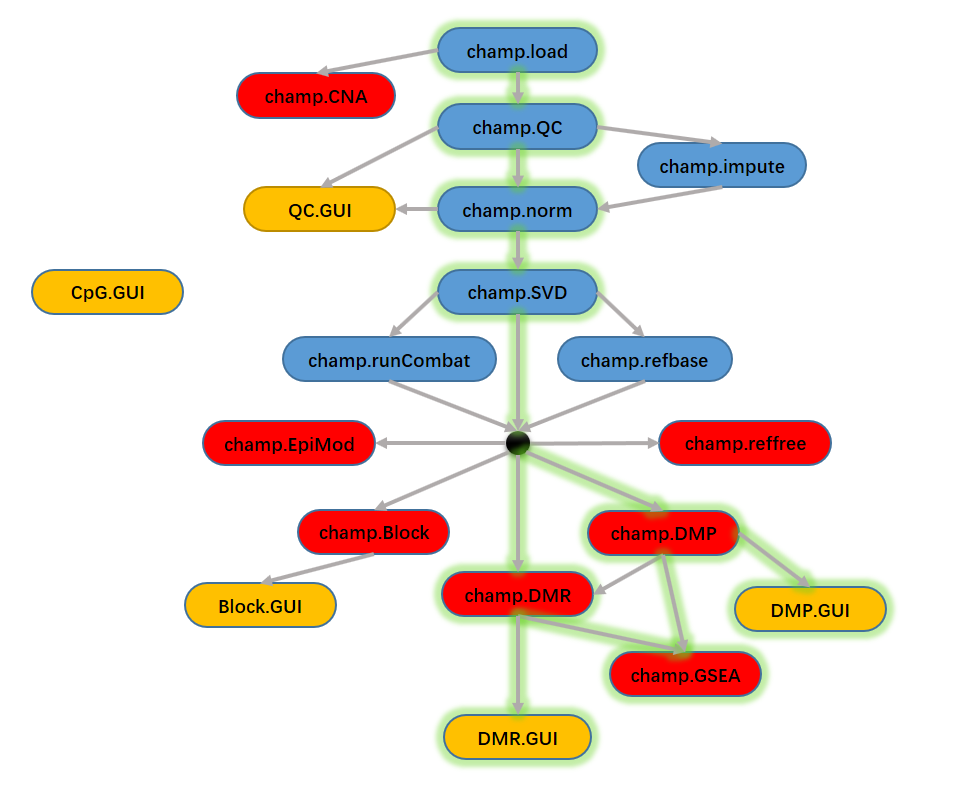
```


ChAMP Pipeline Figure above outlines the steps in the ChAMP pipeline. Each step can be run individually as a separate function. This allows integration between ChAMP's result and other analysis pipelines. In above pipeline plot, all functions of ChAMP are included, which are categorized using three colors:

* **Blue** functions represent functions for Methylation Data Preparation, like Loading, Normalization, Quality Control checks etc.
* **Red** functions represent functions for generating analysis results, like Differentially Methylated Positions (DMPs), Differentially Methylated Regions (DMRs), Differentially methylated Blocks, EpiMod (a method for detecting differentially methylated gene modules derived from FEM package), Pathway Enrichment Results etc.
* **Yellow** functions represent GUI interface for dataset and analysis results.

Solid gray line in above plot represent stream of pipeline, while dash gray line represent functions may not necessarily be used, which depends on your data and projects.

In the above plot, there are some functions and connections (lines) marked with green gleam, which indicate the **Main Analysis Pipeline**. ChAMP combines many functions, but not all of them may be used for a successful analysis. The green gleam represents a main analysis pipeline **most likely** to be used for various data sets. We also marked steps for these main pipeline steps, which should be helpful for new users. The black dot in the middle of the plot represents **fully prepared methylation datasets**, which is the milestone between data preparation and data analysis. Thus, we suggest you save the fully prepared data since your other analyses may be started from it directly.

## Full Pipeline

The full pipeline can be run at once with one command:

```{r eval=FALSE}
champ.process(directory = testDir)
```

When running the full pipeline through the champ.process() function a number of parameters can be adjusted. These parameters are related to all functions involved in the ChAMP package, but not all parameters are covered, otherwise champ.process() function would be too large; please check the manual of ChAMP for parameter settings.

## Separated Steps

We note that champ.process() may not always run successfully, which is likely due to particularities of specific data sets . For example, the covariate of interest in the pd file may not be denoted "Sample_Group" but another category, for example, "Disease", but in the ChAMP function, "Sample_Group" is set as default as the variable of interest. If you encounter any problems when using champ.process(), we recommend you apply it in a step-by-step fashion:

```{r eval=FALSE}
myLoad <- cham.load(testDir)
# Or you may separate about code as champ.import(testDir) + champ.filter()
CpG.GUI()
champ.QC() # Alternatively: QC.GUI()
myNorm <- champ.norm()
champ.SVD()
# If Batch detected, run champ.runCombat() here.
myDMP <- champ.DMP()
DMP.GUI()
myDMR <- champ.DMR()
DMR.GUI()
myBlock <- champ.Block()
Block.GUI()
myGSEA <- champ.GSEA()
myEpiMod <- champ.EpiMod()
myCNA <- champ.CNA()

# If DataSet is Blood samples, run champ.refbase() here.
myRefbase <- champ.refbase()
```

We note that the above implementation of the ChAMP functions uses default parameter specifications, and that therefore parameters can be adjusted and integrated with users' other unique analysis tools and methods. For details of parameter options, please check the relevant sections of this vignette, or the ChAMP manual.


## EPIC pipeline

ChAMP provides a friendly user interface for EPIC array analysis. Most functions are the same for both 450K array and EPIC array, the only difference lies in a parameter 'arraytype', used for some functions which require annotation files: you simply need to set this parameter to "EPIC".
In the ChAMP package, we created a simulation EPIC dataset (beta value only). The pipeline to analyse EPIC array is below:


```{r eval=FALSE}
# myLoad <- champ.load(directory = testDir,arraytype="EPIC")
# We simulated EPIC data from beta value instead of .idat file,
# but user may use above code to read .idat files directly.
# Here we we started with myLoad.

data(EPICSimData)
CpG.GUI(arraytype="EPIC")
champ.QC() # Alternatively QC.GUI(arraytype="EPIC")
myNorm <- champ.norm(arraytype="EPIC")
champ.SVD()
# If Batch detected, run champ.runCombat() here.This data is not suitable.
myDMP <- champ.DMP(arraytype="EPIC")
DMP.GUI()
myDMR <- champ.DMR()
DMR.GUI()
myDMR <- champ.DMR(arraytype="EPIC")
DMR.GUI(arraytype="EPIC")
myBlock <- champ.Block(arraytype="EPIC")
Block.GUI(arraytype="EPIC") # For this simulation data, not Differential Methylation Block is detected.
myGSEA <- champ.GSEA(arraytype="EPIC")
myEpiMod <- champ.EpiMod(arraytype="EPIC")

# champ.CNA(arraytype="EPIC")
# champ.CNA() function call for intensity data, which is not included in our Simulation data.
```


## Computational Requirements

The ability to run the pipeline on a large number of samples depends somewhat on the memory available. The ChAMP pipeline runs 200 samples successfully on a computer with 8GB of memory. Beyond this it may be necessary to find a server/cluster to run the analysis on.

The champ.load() function uses the most memory. If you plan to run the analysis more than once it is recommended to run `myLoad <- champ.load()` and save this list for future analyses.

In champ.DMR(), champ.norm() and champ.Block() functions, some methods may use parallel method to accelerate the process. If your server or computer has more cores, you may specify more cores at the same time to make the function run faster, though this may cost more memory. You can use the following code in R to detect number of cores.


```{r eval=FALSE}
library("doParallel")
detectCores()
```

GUI functions requires more things. **A basic framework for a GUI environment is required**. If you run ChAMP on your own computer, it should be fine. But if you run ChAMP on a remote server, a local display system is essential to use these WebBrower-based GUI functions. X11 is a very common used tool for this. For Windows users, [Xmanager](https://www.netsarang.com/products/xmg_overview.html) or [MobaxTerm](http://mobaxterm.mobatek.net/) are excellent choices.


> A significant improvement for ChAMP is that users can also conduct full analysis even if they are not starting from raw .idat files. As long as you have a methylation beta matrix and the corresponding phenotypes (pd) file, you can conduct nearly all of the ChAMP analysis. This makes analysis easier for users who have beta-values only but not original idat files, for example if users obtain data from TCGA or GEO.

# Description of ChAMP Pipelines

As previously mentioned, users have the option to run each of the ChAMP functions individually to allow integration with other pipelines or to save the results at each step. Below we describe each function in further detail.

## Loading Data


Loading data is always the first step. ChAMP provides a loading function to get data from .idat files (with pd file (Sample_Sheet.csv) in it). The old champ.load() function utilises minfi to load data from .idat files, but now we provide a new method "ChAMP" to read data. The two loading methods effectively return the same objects, except that the old version would also return rgSet and mset mset objects, which might be used as input to SWAN and FunctionalNormliazation method in champ.norm(). By default this loads data from the current working directory, in this directory you should have all .idat files and a sample sheet. The sample sheet currently needs to be a .csv file as came with your results following hybridization. The champ.load() function used to load the data from the idat files automatically filters out the SNPs that might influence the analysis result. The SNP list was generated from [Zhou's Nucleic Acids Research paper in 2016](http://zwdzwd.github.io/InfiniumAnnotation) [@Zhou2016], which is designed specifically for 450K and EPIC, also with population differences considered. As such, for 450k bead array data, before filtering for low quality probes, the dataset will include 485,512 probes. And for EPIC bead array data, before filtering probes the dataset, will include 867,531 probes.

Currently the default method for loading is "ChAMP". You may set "method" in champ.load() to use classical minfi way. **Note that "ChAMP" method in champ.load() is merely a combination of champ.import() and champ.filter()**. If you are not satisfied with result returned by champ.load(), say you want to get beadcount, detection P matrix, or Meth UnMeth matrix, you may use champ.import() to generate them.

User may invoke following code to load data set:


```{r eval=FALSE}
myLoad <- champ.load(testDir)
```

Alternatively, the user can load the data from the dataset object testDataSet in ChAMPdata package, using:


```{r eval=TRUE}
data(testDataSet)
```

It is important to check the pd file (Sample_Sheet.csv). Most pd files are similar in format, but their most valuable information are not always stored in same column, for example, for most pd files, Sample_Group means groups of phenotype wants to be researched, but in some pd files, similar information may be stored in columns named as "Diagnose" or "CancerType", so the user **MUST** understand their pd file well to achieve a successful analysis.

```{r eval=TRUE}
myLoad$pd
```

As we can see here, the Sample_Group contains two phenotypes: C and T, which is what we want to compare. In this data set, C means "Control", while T means "Tumor".

## Filtering Data

ChAMP provides a comprehensive filtering function called `champ.filter()` which can take any data matrix as input (beta, M, Meth, UnMeth, intensity) and do filtering on it. champ.filter() does not call for any specific object or class result, nor does it need an IDAT file, as long as you have a single beta matrix, the filtering can be done. In champ.filter(), since some probes and samples might be removed for reason of low quality, NA might be still exist in filtered data. So, we provided a parameter `autoimpute` in the function to conduct imputation on remain probes, if NAs are still existing. Actually, imputation work is done by champ.impute() function, reader may check that function for more information.

For some filtering methods, additional data must be provided, for example if you want to perform filtering using detection P-values, you need to provide a detection P-value matrix. Also, if you want to perform filtering based on beadcounts, you need to provide the beadcount information. If you read IDAT file with champ.load() function's default method "ChAMP", beadcount information should be included in returned result. Also champ.filter() is designed to do filtering on multiple types of data frames from same data set, say you have beta matrix, M matrix, intensity matrix from same .idat file, you may use champ.filter() to do filtering on them at the same time, which would keep their compliance in future analysis.


* First, you must input at least one data matrix.
* Second, if you provide as input multiple matrices, they must have **EXACTLY** the same rownames and colnames. For example, if you want to do filtering on intensity data and M value at the same time, you MUST make sure they have the same name, otherwise, ChAMP will assume they are data frames from different sources. Then, champ.filter() would stop filtering process.
* Since low quality samples (e.g. those with many undetected probes) may be removed during the process of filtering, it is important to ensure that the Sample_Name identifiers in your pd file are exactly the same as colnames of your data matrix
* Fourth, if you want to do imputation, you must provide the detection P matrix, beta or M matrix, and the parameter ProbeCutoff can not be 0, this parameter controls threshold of NA ratio that a probe should be removed or not. If any of these three conditions fail, champ.filter() would reset autoimpute parameter as FALSE, then imputation process would not be done.
* Fifth, if you want to filter by beadcount, you must provide the beadcount, champ.import() would return beads information. Or, you can use beadcount function from wateRmelon package to extract is from rgSet object from "minfi" method..


The champ.filter() function is the after process of champ.import() which is a novel loading function coded by ChAMP team. You may use them like below:

```{r eval=FALSE}
myImport <- champ.import(testDir)
myLoad <- champ.filter()
```

Then the result of champ.filter() (myLoad in above code), should be the same result as old minfi method.

Actually During the loading process, champ.load() function would also do some filtering. Below are filtering steps which would be performed during both champ.load() and champ.filter().

* **First filter is for probes with detection p-value (default > 0.01).** This utilises detection p-value stored in .idat file. champ.import() would read these information and form them into data frame. For each probe, if it's p value is above then 0.01, it would be considered as failed probe. A failedSamples result will be printed to the screen, showing the fraction of failed probes per sample. If any of these values is high (> 0.1) you may want to consider removing that sample from the analysis and rerun it. Previously we found that in many cases, only one or two samples in a big data set are not qualifed for analysis, and they may have 70% or even 80% of failed probes. So if we only do filtering on probes, about 80% of probes will be masked, so we developed a new filtering system on both sample and probe quality. If a certain sample's failed probes' ratio is above a particular threshold (default = 0.1), then this sample will be discarded, and filtering of probes will be carried on the remaining samples. The threshold of sample and probe can be controlled by the parameter SampleCutoff and ProbeCutoff separately.

* **Second, ChAMP will filter out probes with <3 beads in at least 5% of samples per probe.** This default can be changed with the filterBeads parameter or the frequency can be adjusted with the beadCutoff parameter.

* **Third, ChAMP will by default filter out all non-CpG probes contained in your dataset.**

* **Fourth, by default ChAMP will filter all SNP-related probes.** The SNP list comes from [Zhou's Nucleic Acids Research paper in 2016](http://zwdzwd.github.io/InfiniumAnnotation). Note that if you know which population your data is from, you can choose certain populations to do the filtering. Otherwise ChAMP would use General Recommended Probes provided by Zhou to do filtering. You just need to assign "population" parameter to achieve this.

* **Fifth, by default setting, ChAMP will filter all multi-hit probes.** The multi-hit probe list comes from [Nordlund's Genome Biology Paper in 2013](https://genomebiology.biomedcentral.com/articles/10.1186/gb-2013-14-9-r105)[@Nordlund2013].

* **Sixth, ChAMP will filter out all probes located in chromosome X and Y.** This is also a default setting, but user can change it with filterXY parameter.


All above filterings are controlled by parameters in the champ.load() and champ.filter() function, and users may adjust them as they wish. Note that, though most ChAMP functions are supporting isolated beta matrix analysis, which means not relying on .idat files from the beginning, **champ.load() can not perform filtering on beta matrix alone. For users have no .IDAT data but beta matrix and Sample_Sheet.csv, you may want perform filtering using the champ.filter() function and then use following functions to do analysis.**

In addition to the filtering capability, we also provide a function CpG.GUI() for the user to check their distribution of CpGs on chromosome, CpG island, TSS reagions. e.g.  This function can be used for any CpGs list, for example, during your analysis, whenever you get a significant CpG list from DMR, you can use the following function to check the distribution of your CpG vector:

```{r eval=FALSE}
CpG.GUI(CpG=rownames(myLoad$beta),arraytype="450K")
```
```{r, out.width = 800, fig.retina = NULL,echo=F}
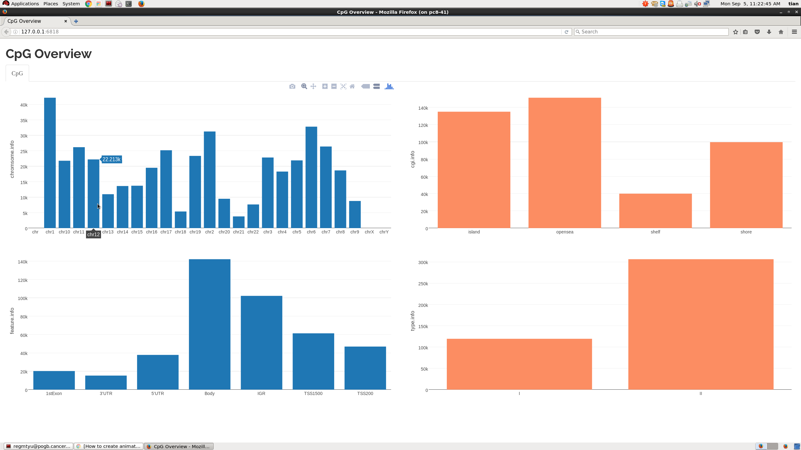
```

This is a useful function to demonstrate the distribution of your CpG list. If you get a DMP list, you may use this function to check your DMP's distribution on chromosome.

## Further quality control and exploratory analysis

Quality Control is an important process to make sure dataset is suitable for downstream analysis. champ.QC() function and QC.GUI() function would draw some plots for user to easily check their data's quality. Usually, there are three plots that would be generated:

```{r eval=TRUE,dpi=100,fig.width=7,fig.height=4,message=FALSE}
champ.QC()
```

* mdsPlot (Multidimensional Scaling Plot): This plot allows a visualization of the similarity of samples based on the top 1000 most variable probes amongst all samples. Samples are colored by Sample Groups in this plot.
* densityPlot: The beta distributions for each sample; users may use this figure to find samples which deviate significantly from others and which may not be of good quality (e.g. incomplete bisulfite conversion). NB: It also serves to identify and confirm methylated or unmethylated control samples, if these were included in the study).
* dendrogram: The clustering plot for all samples, you may select different method to generate this plot. There is a parameter `Feature.sel="None"` in champ.QC() function. While "None" means the distance between samples would be calculated directly by all probes (your server may crash if you directly do this on a large data set), "SVD" means champ.QC() function would use SVD method to do deconvolute on beta matrix, then select significant components based only EstDimRMT() method from "isva" package. Then the distance between samples would be calculated based on these components.

Or you may use QC.GUI() function as below, which however may be memory intensive, so make sure you have a good server or computer when you run this GUI function in ChAMP.


```{r eval=FALSE}
QC.GUI(beta=myLoad$beta,arraytype="450K")
```
```{r, out.width = 800, fig.retina = NULL,echo=FALSE}
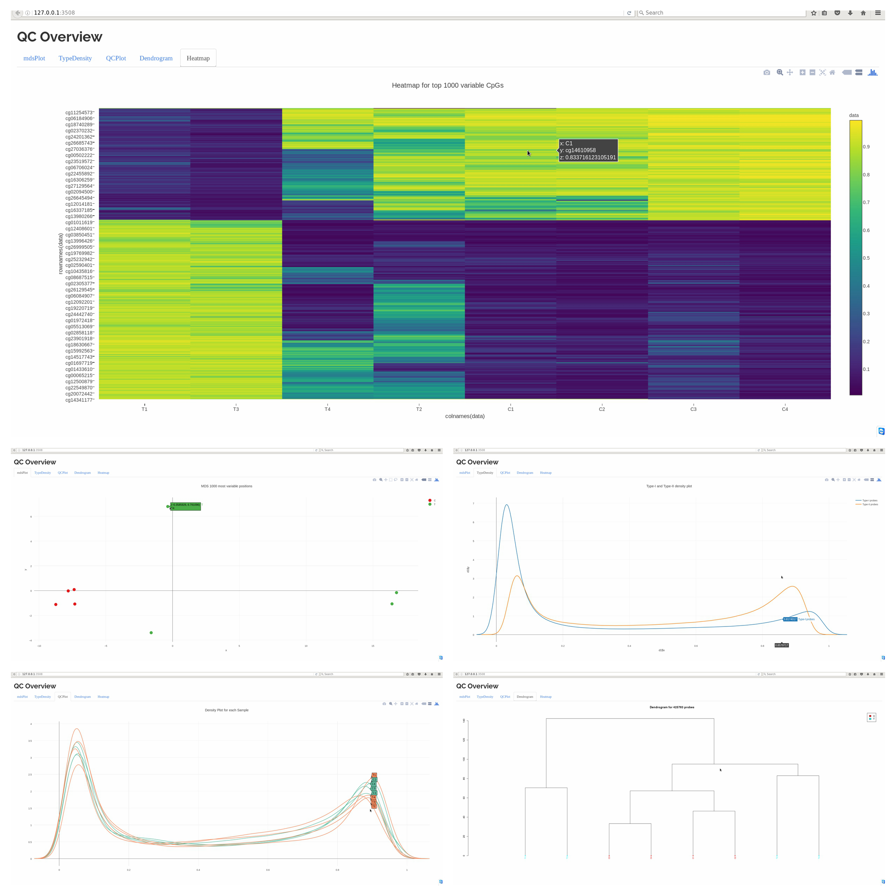
```

In contrast to champ.QC(), QC.GUI() will provide five interactive plot. These plots are as follows; mdsPlot, type-I&II densityPlot, sample beta distribution plot, dendrogram plot and top 1000 most variable CpG's heatmap. Users may easily interact with these plots to see if your samples are qualified for further analysis, and check clustering result and top CpGs.

* Probe-Type-I&II plot: the beta distributions of Type-I and Type-II probes in your dataset, which could help you to check your data set's normalization status.
* Top variable CpGs' heatmap: This heatmap would select most variable CpGs, and create a heatmap based on the methylation values at these sites.


## Normalization

On Illumina beadarrays, probes come in two different designs (called type-I and type-II), with different hybridization chemistries, which means that probes from these two different designs will exhibit different distributions. This is a technical effect and is independent of variations caused by differences in the biological characteristics (e.g. CpG density) of type-I and type-II probes. The most marked difference between the type-I and type-II methylation distributions is that the type-II distribution exhibit a reduced dynamic range. In supervised analyses, this could cause a bias in the selection of type-I over type-II probes. For DMR detection, where type-I and type-II probes may fall in the same regions, it is clear that adjustment is paramount.  In general, adjustment for the type-II probe bias is recommended, and you can use the champ.norm() function to perform this normalization.

In champ.norm(), we provide **four methods** to do this type-II probe normalization: BMIQ [@Teschendorff13], SWAN [@Maksimovic12], PBC [@Dedeurwaerder11] and FunctionalNormliazation [@Fortin2014]. There are some key differences between each method, and users may read related papers to select the most appropriate one for their analysis.

Currently, FunctionalNormalization requires rgSet, SWAN requires mset and rgSet objects generated from IDAT files (as described in the minfi package description) while FunctionalNormliazation requires an rgSet object. Consequently, FunctionalNormliazation and SWAN normalization methods only works for analyses for "minfi" loading method.

Note that the BMIQ function has been updated to version 1.6, which should provide better normalization for EPIC array data. We note that BMIQ may not converge and provide output for certain samples, and this may happen if the methylation distribution of the sample deviates markedly from a 3-state beta-mixture distribution (as it may happen for methylated/unmethylated controls), or because of poor sample quality. A new feature is that the BMIQ function can now be run in parallel, so if your computer has more than one core, you may set parameter "cores" in function to accelerate the function. If you set parameter `PDFplot=TRUE`, the plot for BMIQ function would be saved in resultsDir.

The code to do Normalization is below:
```{r eval=FALSE}
myNorm <- champ.norm(beta=myLoad$beta,arraytype="450K",cores=5)
```

After Normalization, you may use the QC.GUI() function to check the result again; remember to set the beta parameter in QC.GUI() function as "myNorm".

## SVD Plot

The singular value decomposition method (SVD) implemented by Teschendorff [@Teschendorff09] for methylation data is a powerful tool for assessing the number and nature of the significant components of variation in a dataset. These components of variation would ideally correlate with biological factors of interest, but generally also correlate with technical sources of variation (e.g. batch effects). We strongly advise users to collect as much information as possible of the samples being analysed (e.g. dates of hybridization, season in which samples were collected, epidemiological information, etc etc) and to include all of these factors when correlating to SVD components. If samples have been loaded from .idat files then the 18 internal probe controls on the beadchip (including bisulphite conversion efficiency) will be included if you set parameter RGEffect=TRUE in the champ.SVD() function. Also compared with the old version of the ChAMP package, the current version of champ.SVD() would detect all valid factors to perform analysis, which means the plot contains the two following conditions:

* Covariates are not associated with name, Sample_Name or File_Name
* Covariates contain at least two values(for example, for 'BeadChip ID' to be tested as a covariate, samples from at least two different BeadChips must be included in the study)

champ.SVD() function detects all valid covariates in your pd file. Thus if you have some unique covariates you want to be analysed, you may combine them into your pd file, allowing champ.SVD() to test for association with the most significant components of variation in the dataset. Note that champ.SVD() will only uses phenotype data in the form of a pd file. So, if you have your own covariates which you want to be analysed with your current pd file, please cbind() your covariates along with myLoad$pd, then use this object as input for the pd parameter of the champ.SVD() function.

Note that, for different type of covariates (categorical and numeric), champ.SVD()uses different methods to calculate the significance between covariates and components (Krustal.Test and Linear Regression) . Thus, please make sure your pd object is a data frame and numeric covariates are transferred into "numeric" type, while categorical covariates are transferred into "factor" or "character" type. **If your Age covariate was assigned as "character", the champ.SVDfunction will not detect that it should be analysed as numeric. Thus, we suggest users have very clear understanding of their dataset and pd files.**

While champ.SVD() is running, all detected covariates will be printed on the screen, so that the user may check if the covariates you want to analyse are correct. The result is a heatmap (saved as SVDsummary.pdf) of the top  principal components correlated to the covariates information provided. In champ.SVD() we used Random Matrix Theory from isva package to detect numbers of latent variables. If our method detected more than 20 components, we would select only top 20. In the heatmap, the darker colours represent a more significant p-value, indicating a stronger correlation of the SVD component with a factor of interest. If the SVD analysis shows that technical factors account for a substantial fraction of variation, then it will be necessary to implement other normalization methods (e.g ComBat) that may help remove this technical variation. ComBat is included in the ChAMP pipeline to remove variation related to the beadchip, position and/or plate, but it may be used to remove other batch effects revealed in the SVD analysis.

You may use the following code to generate the SVD plot:

```{r eval=FALSE}
champ.SVD(beta=myNorm,pd=myLoad$pd)
```

```{r, out.width = 800, fig.retina = NULL,echo=FALSE}
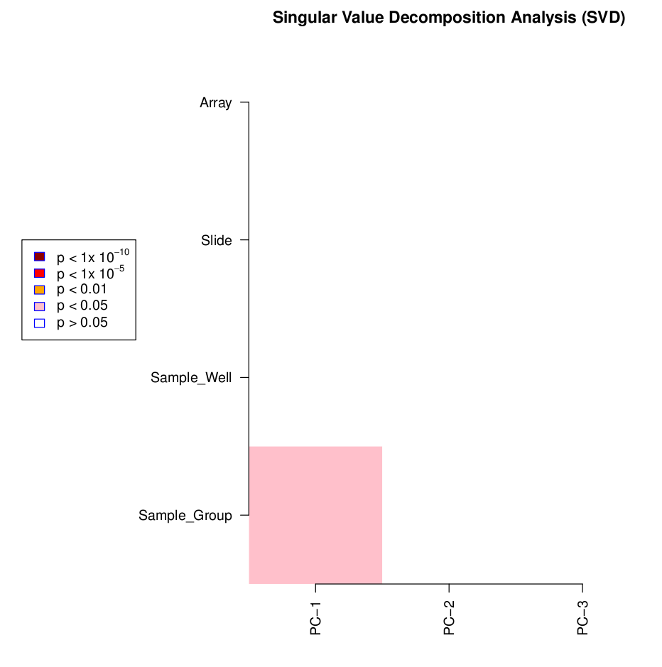
```


Above plot is generated on our Demo 450K array data set. Since there are only 8 samples in that data set, so the final headmap plot looks not complicated. Below we used another plot from [GSE40279](https://www.ncbi.nlm.nih.gov/geo/query/acc.cgi?acc=GSE40279), this data contains 656 sample, and a complicated pd file, with covariates like Age and Race included. Below we are showing the result of SVD plot we generated by using champ.SVD() function.

```{r, out.width = 800, fig.retina = NULL,echo=FALSE}
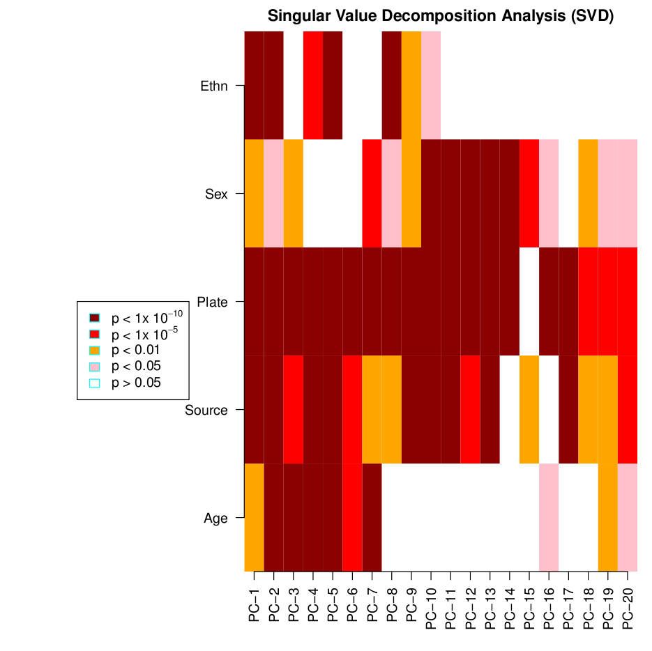
```

In above plot, Age is a numeric variable, while other factors are categorical factors. The darker block means stronger correlation between deconvoluted components and covariates.

## Batch Effect Correction

This function implements the ComBat normalization method [@Johnson07] that was developed for microarrays. The sva R package is used to implement this function. ComBat is specifically defined in the ChAMP package to correct for batch effects. More advanced users can implement ComBat using sva documentation to adjust for other batch effects. You need to set parameter `batchname=c("Slide")` in the function to correct them.

> Note that champ.runCombat() would extract batch from your batchname, so please make sure you understand you dataset perfectly. Another important thing is, previously champ.runCombat() would automatically assume `Sample_Group` is the covariates need to be analysed, but now, we added a parameter called `variablename` so that users may assign their own covariates to analysis, thus **for some data set whose disease phenotype is NOT Sample_Group, please remember to assign variablename parameter.**

ComBat algorithm uses an empirical Bayes method to correct for technical variation. If ComBat were applied directly to beta values, the output may not be bounded between 0 and 1. For this reason ChAMP logit transforms beta values before ComBat adjustment and then computes the reverse logit transformation following the ComBat adjustment. **If the user has chosen to use M-values, please assign `logitTrans=FALSE`.**

During the function champ.runCombat(), the program would automatically detect all valid factors might be corrected and list on screen, so that user may check if there are the batches you want to correct. Then if the batchname assigned by user are correct, the function would started to do batch correction.

In the latest version, champ.runCombat() would also check if user's Batch and Variable counfounded with each other. Confounding means all samples from one phenotype of your variable are comes from certain one phenotype of your batch, which means, if you correct batches, your variable-contained information are also gone, which is not allowed in Combat function of SVA package, that's why we made check beforehead.

You can use following code to do batch correction:

```{r eval=FALSE}
myCombat <- champ.runCombat(beta=myNorm,pd=myLoad$pd,batchname=c("Slide"))
```

> **The ComBat function could be a very time consuming step in the pipeline if you have a large number of samples.** After correction, you may use champ.SVD() function to check the corrected result.

## Differential Methylation Probes

Differentially Methylated Probes (DMPs) is the most common desired output. Here users may use champ.DMP() function to calculate differential methylation, and can use DMP.GUI() to check the result.

champ.DMP() function implements the limma package to calculate the p-value for differential methylation using a linear model. Our latest champ.DMP() function would support numeric variable like age, and categorical variables which contain more than two phenotypes, like "tumor", "metastasis", "control". If our function detected numeric variables like age, linear regression would be conducted on each CpG sites, to find your covariate-related CpGs, say age-related CpGs. While categorical variables detected, champ.DMP() would do contrast comparison between each two phenotypes in your covariate. Say you have covariate as "tumor", "metastasis", "control", then champ.DMP() would compare "tumor--metastatic", "tumor-control", and "metastatis-control". Each comparison would return one data frame containing significantly differential methylated probes.

The output of champ.DMP() includes **some data frames** of P-value, t-statistic and difference in mean methylation (this is labeled as logFC since it is analogous to the log fold-change in gene expression analysis) between two groups (for categorical covariate only). It also includes the annotation for each probe, the average beta value for the sample group, and the delta beta value for the two groups used in the comparison (delta value is same as logFC, we kept is here because very old version ChAMP used it).

> In our latest version champ.DMP(), numeric variables are fully support not, if you have covariate like ages or time series data. However, more advanced users can run limma with other settings and use the output (including all probes and their p-values) for the DMR hunter.

Users may use following code to get DMPs (still we are using Demo 450K test data here):
```{r eval=TRUE,warning=FALSE,message=FALSE}
myDMP <- champ.DMP(beta = myNorm,pheno=myLoad$pd$Sample_Group)
```

We can check the result of champ.DMP() as below. Remember that in champ.DMP(), **each returned result would be stored in an element in a list.** Each element in the list is one result of DMPs detected between two phenotypes. If your covariate is numeric variable, the returned data frame name is "NumericVariable". If your covariate is categorical variable, the returned name would be "PhenoA_to_PhenoB", where "PhenoA" and "PhenoB" are two name of your phenotypes.

```{r eval=FALSE}
head(myDMP[[1]])
```

In new version of ChAMP, we include a GUI interface for user to check the result of myDMP generated from above code. You just need to provide the **"unmodified"** result of champ.DMP (myDMP), orginal beta matrix you used to generat DMP (beta) and covariates you want to analyse. DMP.GUI() function would automatically detect if your covariate is numeric or categorical. If your covariate is numeric, DMP.GUI() would plot scatter plot for each CpGs, showing trend of beta value along with your covariate. If your covariate is categorical variable like cancer/normal, DMP.GUI() would plot boxplot for significantly differential methylated CpGs. You can use following code to open DMP.GUI() function.

```{r eval=FALSE}
DMP.GUI(DMP=myDMP[[1]],beta=myNorm,pheno=myLoad$pd$Sample_Group)
# myDMP is a list now, each data frame is stored as myDMP[[1]], myDMP[[2]], myDMP[[3]]...
```

```{r, out.width = 800, fig.retina = NULL,echo=FALSE}
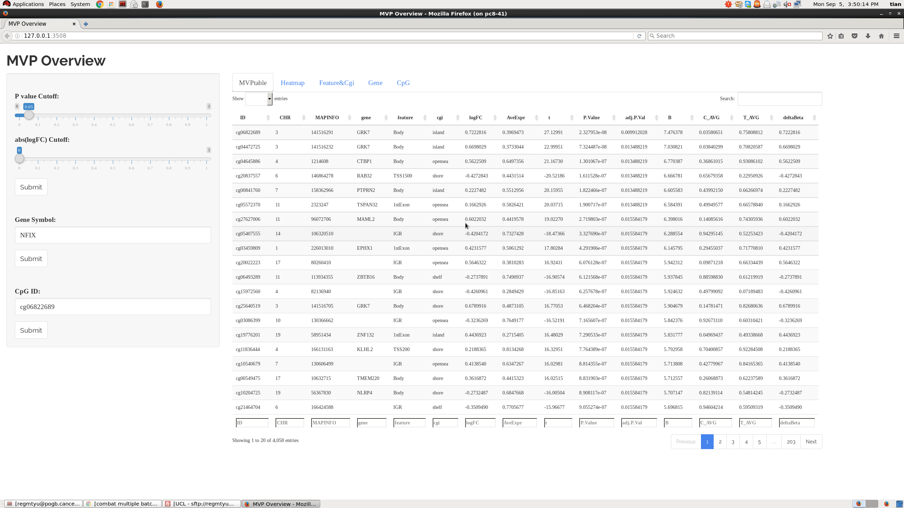
```

The left panel indicates the cut off parameters for significant CpGs. Currently only two parameters are supported here: P-value and abs(logFC). Users may set these two values then press "Submit" to generate significant CpGs table on the right. On the right is the table of significant CpGs, all information are included, the table can be ranked by each column.

```{r, out.width = 800, fig.retina = NULL,echo=FALSE}
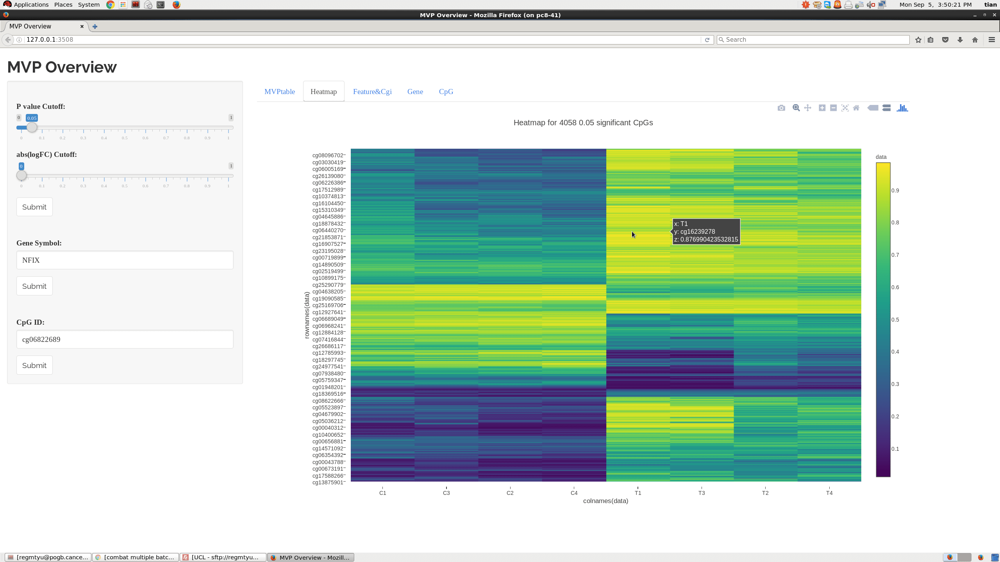
```

The second tab provides the heatmap of ALL significant CpGs you generate by left panel cutoffs. **Note that rows and columns of this heatmap has been Hierarchical Clustered.**

```{r, out.width = 800, fig.retina = NULL,echo=FALSE}
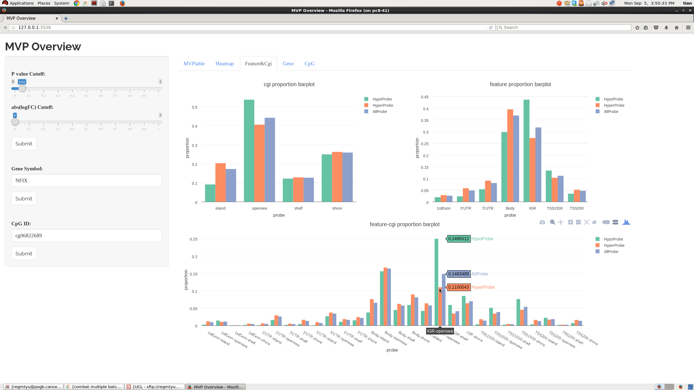
```

The third panel provides the barplot of proportion of each CpG feature(e.g. TSS200, TSS1500, body, opensea, shore) and cgi summary information for hyper and hypo CpGs. **You may press the marker in the legend to close or open certain bars.**

The fourth tab is controled by the `Gene` parameter on the left panel. You may select a gene name (the example default is NFIX here) and press "submit". Then the plot for this gene will be plot above. Note that the x axis here is not the actual MAPINFO of each CpG. The distance between each CpG are the same. There are two kinds of lines plotted for each phenotype, the solid lines represent Mean Value plot, and the dash line represent the Loess line, user may close or open they by clicking the marker on the legend. Below is the feature and cgi information of each CpG. At the bottom of this tab, is the gene information extracted from wikigene, which is also controlled by the gene parameter on the left.


```{r, out.width = 800, fig.retina = NULL,echo=FALSE}
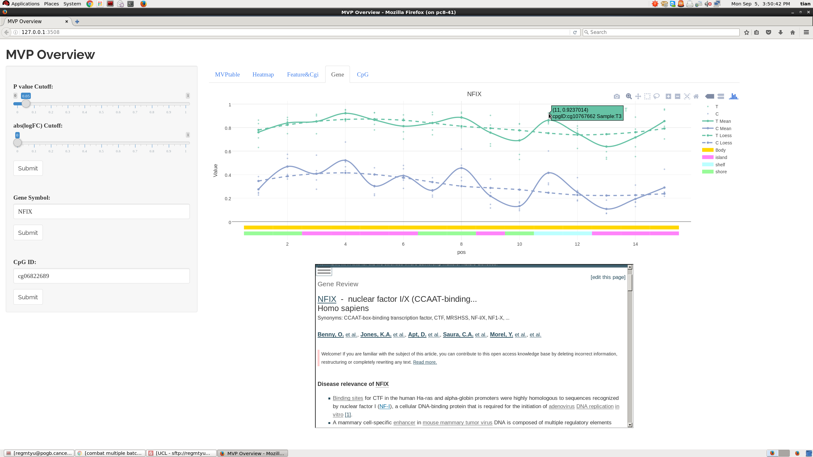
```

The fifth tab includes two plots. At the top is the enrichment plot for top 70 genes involved in significant CpGs you select by left cutoff parameters. The number in each bar indicates how many hyper or hypo differential methylated CpGs are included in this gene. Users may use this plot to find intereted genes then use tab 4 to plot these genes. At the bottom of this tab, is the boxplot of certain CpGs, which is controled by parameter on the left panel.

> Note that all plots here can be Zoomed in or out. And can be downloaded directly. You may even change the shape of the brower to resize of plot then download it with different resolution.

### DMP.GUI performance on numeric variable

Above DMP.GUI plots are generated on our Demo 450K array. Since that's a categorical covariate data set, below we are showing part result from a numeric covariate data set: GSE40279. Here we are doing whole analysis, but showing the DMP.GUI() webpage for Age-related CpGs detected from champ.DMP() on GSE40279 data set. **Note that we get below  result after steps like loading, filtering, normalization.e.g. then run champ.DMP() and DMP.GUI().**

> For numeric variable, to showing the trend of beta value change along with variable, DMP.GUI() would automatically cut the numeric variable into couple groups increasingly (default is 4), then plot lines and dot based on each group. **Say if your variable is age, DMP.GUI() would automatically cut your age variable into couple groups, like 30-, 30-50, 50-70, 70+, then four lines and groups of dots would be plotted. Thus you may see the line for old sample group is significantly different from line from the youngest group.**

Firstly we show the third tab (gene related tab) of DMP.GUI() webpage:

```{r, out.width = 800, fig.retina = NULL,echo=FALSE}
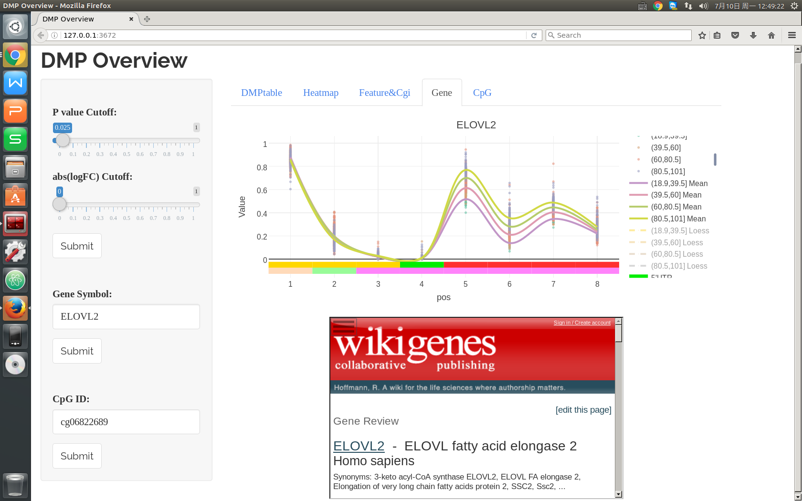
```

In above plot, we can see that DMP.GUI() automatically cut age covariate into 4 groups. Then for each group, dots ant lines are plotted. We can see that in gene ELOVL2, there are 8 CpGs in total shows age-related trend. And lines show that older group (80.5 ~ 101), tend to be hypermethylated than younger groups.

Then we show the fourth tab (CpG related tab) of DMP.GUI() webpage:

```{r, out.width = 800, fig.retina = NULL,echo=FALSE}
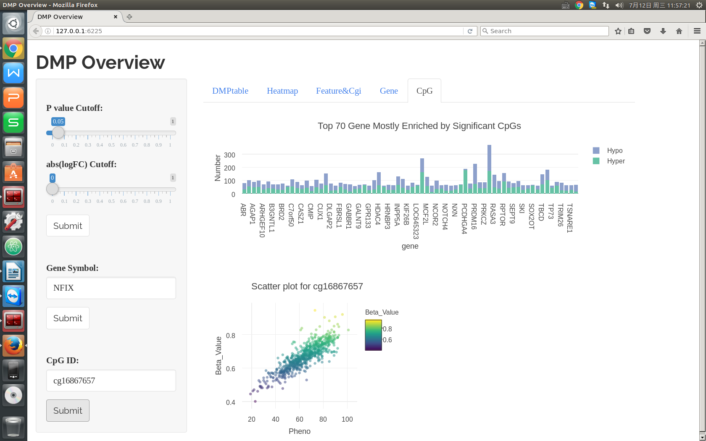
```

In above plot, CpGs are plotted in to scatter plot, so that we can see trend of CpG along with age.


### Hydroxymethylation Analysis

Some users might want to analyse hydroxymethylation data, which can be done with champ.DMP() function, here we provided some demo code below for user to check.

```{r eval=FALSE}
myDMP <- champ.DMP(beta=myNorm, pheno=myLoad$pd$Sample_Group, compare.group=c("oxBS", "BS"))
# In above code, you can set compare.group() as "oxBS" and "BS" to do DMP detection between hydroxymethylatio and normal methylation.

hmc <- myDMP[[1]][myDMP[[1]]$deltaBeta>0,]
# Then you can use above code to extract hydroxymethylation CpGs.
```

## Differential Methylation Regions

Differentially Methylated Regions (DMRs) are extended segments of the genome that show a quantitative alteration in DNA methylation levels between two groups. champ.DMR() is the function ChAMP provides to compute and return a data frame of probes binned into discreet differentially methylated regions (DMRs), with accompanying P-value.

There are three DMR algorithms implemented within ChAMP: Bumphunter, ProbeLasso and DMRcate. The Bumphunter algorithm first groups all probes into small clusters (or regions), then applies random permutation method to estimate candidate DMRs. This method is very user friendly and is not relying on any output of previous functions. The permutation step in Bumphunter may be computer-intensive, but user may assign more cores to accelerate it. The result of bumphunter algorithm is a dataframe containing all detected DMRs, with their length, clusters, number of CpGs annotated.

For ProbeLasso method, the final data frame is distilled from a limma output of probes and their association statistics. Previously, the result from champ.DMP() must be inputted into champ.DMR() function to do run ProbeLasso, but now we have upgraded the function and ProbeLasso needs no result from champ.DMP() anymore. For the principle and mechanism of ProbeLasso function, user may find it in original paper [@Butcher201521].

A new method recently incoporated into ChAMP is DMRcate. This is a data-driven approach that is agnostic to all annotations except for spatial ones, specifically chromosomal coordinates. Critical to DMRcate are robust estimates of differential methylation (DM) at individual CpG sites derived from limma. DMRcate pass the square of the moderated t statistic calculated on each 450K probe to DMR-finding function. Then DMRcate would apply a Gaussian kernel to smooth this metric within a given window, and also derive an expected value of the smoothed estimate (in other words, one with no experimental effect) from the varying density of CpGs incu by reduced representation and irregular spacing. For more detail about DMRcate function, user may read the original paper [@Peters2015] and DMRcate R pacakge.

> **Note that in this version ChAMP, we made some strict checking process in champ.DMR(), now champ.DMR() only takes categorical covariates with EXACTLY only two phenotypes. If your covariates contains multiple phenotype, say "tumor"/"metastasis"/"control", please manually select any two of them, and input corresponding beta matrix and pheno information.**

Users may use following code to generate DMR:
```{r eval=FALSE,message=FALSE,warning=TRUE}
myDMR <- champ.DMR(beta=myNorm,pheno=myLoad$pd$Sample_Group,method="Bumphunter")
```

The output of Bumphunter, DMRcate and ProbeLasso functions are all dataframe, but may contain different columns. Here we can have a check on DMRcate result.

```{r eval=TRUE}
head(myDMR$DMRcateDMR)
```

Just like DMP result, we provide `DMR.GUI()` as interface for DMR result. All result from three different method of champ.DMR() are accepted in the GUI function. The DMR.GUI() function would automatically detected what kind of input the DMR result is. **Thus it's not recommended to modify the structure of myDMR result.**

```{r eval=FALSE}
DMR.GUI(DMR=myDMR)
# It might be a little bit slow to open DMR.GUI() because function need to extract annotation for CpGs from DMR. Might take 30 seconds.
```

```{r, out.width = 800, fig.retina = NULL,echo=FALSE}
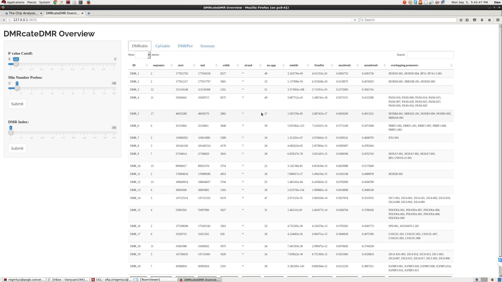
```

Just like the DMP.GUI above, there is a panel for parameters on the left, user may set the parameters to select significant DMRs. We currently only provide two parameters: P-value and min number probes. The above title will indicate the method you have used to get DMR result (here is DMRcate). **Note that for different method the P-value may indicate different columns. Bumphunter is pvaluearea, while ProbeLasso is dmrP, and there is no cutoff for DMRcate result, which has been done during calculation.** After your selection and press "Submit", you will get table of significant DMRs on the right. For different method, the table content might be different. Thus user should research what method you want to use to find DMRs.

```{r, out.width = 800, fig.retina = NULL,echo=FALSE}
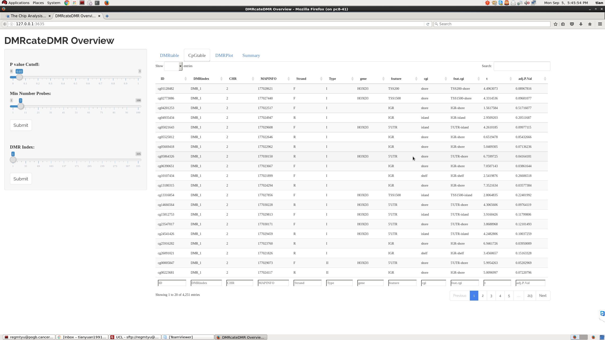
```

The second tab provides a table for all CpGs involvded in these DMRs, which can be regarded as a mapping list between CpGs and DMRs. Also if you can not get gene information in first tab, you can get them here. In this table, for each CpGs, their corresponding genes and DMRs are marked.

```{r, out.width = 800, fig.retina = NULL,echo=FALSE}
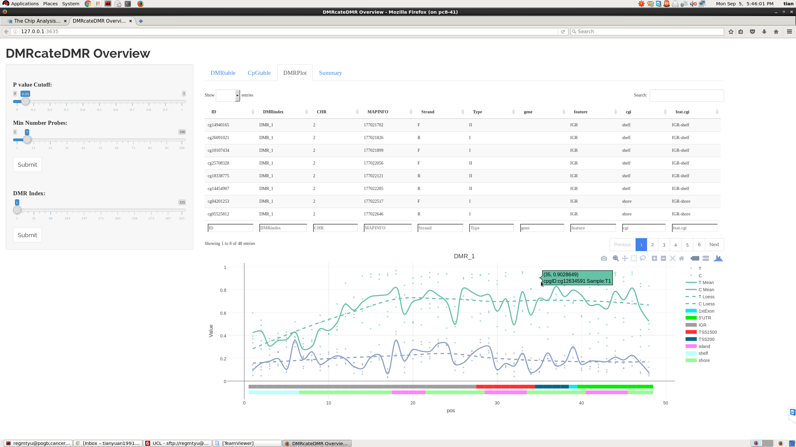
```

The third plot is the plot of each DMR, just like the gene plot in DMP.GUI() function. Here the x axis are not real MAPINFO of each CpG, the distance between each CpGs are equal. Also I have feature and CpGs marked under the plot. At the top of this tab, are the table of all CpGs in this DMR. You can use the DMR index parameter on the left panel to select DMR you want to check.

```{r, out.width = 800, fig.retina = NULL,echo=FALSE}
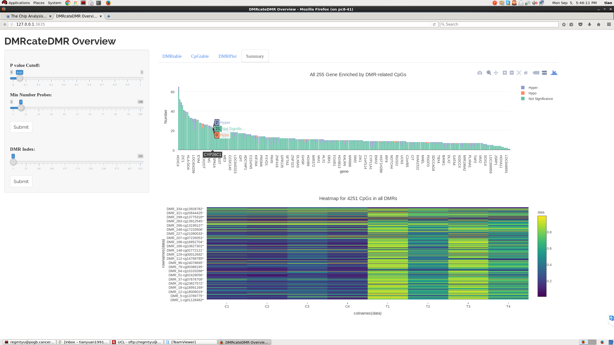
```

The fourth tab provide the enrichment information of genes and heatmap. Note that there might be many genes and CpGs in this plot. So if you have too many DMRs selected, the plot might be too big to be open. But you don't need to worry can not see it clearly, because you may zoom in as much as you can to check details.

> Currently, champ.DMR() does not support multiple phenotypes in one covariates, in theory we can do pairewise comparision, but it would takes very long time. Also, we are not supporing numeric variables, say looking for **"Age-related Methylated Regions"**, it calls for many heavy coding working and we may support that in future version.

## Differential Methylation Blocks

There may also be potential interest to identify Differentially Methylated Blocks (DMBs) 19. Here we provide a function to infer DMBs. In our Block-finder function, champ.Block() would firstly calculate small clusters (regions) on whole genome based on their locations on genome. Then for each cluster (region), its mean value and mean position would be calculated, thus you can assume that each region would be collapsed into a single unit. When we finding DMB, only single unit from open sea would be used to do clustering. Here Bumphunter algorithm will be used to find "DMRs" over these regions (single units after collapse). In our previous paper [@Yuan2015], and other scientists' work [@Timp2014] we demonstrated that Differential Methylated Blocks may show universal feature across various cancers

In recent years, there are more researchs about Differential Methylated Blocks [@Hansen2011]. Here we provide a function to calculate methylation blocks. In our Block-finder function, champ.Block() would firstly calculate small clusters (regions) on whole genome based on their locations on genome. Then for each cluster (region), its mean value and mean position would be calcuated, thus you can assume that each region would be collapsed into a dot. Then Bumphunter algorithsm will be used to find "DMRs" over these regions (dots after collapse). **Note that only open sea regions will be used to calculate Blocks**. In our previous paper [@Yuan2015] we demonstrated that Differential Methylated Blocks may show universal feature across various cancers.

User may use following code to generate methylation blocks:
```{r eval=FALSE}
myBlock <- champ.Block(beta=myNorm,pheno=myLoad$pd$Sample_Group,arraytype="450K")
```

champ.Block() function returns numerous objects, but the most important one is the first list: Block. You may check it like below:

```{r eval=TRUE}
head(myBlock$Block)
```
And we provide a GUI function for users to check the result of myBlock above.

```{r eval=FALSE}
Block.GUI(Block=myBlock,beta=myNorm,pheno=myLoad$pd$Sample_Group,runDMP=TRUE,compare.group=NULL,arraytype="450K")
```

Note that there are two special parameters here: `runDMP` means if Block.GUI() function should calculate DMP for each CpGs, if not, the GUI() function would only return the annotation of all involvded CpG. `compare.group` could to be assigned if you want to calculate DMP while running Block.GUI(), it works if you have multiple phenotypes in our covariates.


```{r, out.width = 800, fig.retina = NULL,echo=FALSE}
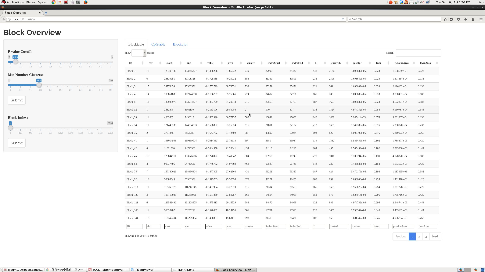
```

Just like DMP.GUI() and DMR.GUI(), the P-value cutoff and min cluster (similar to min probes in DMR.GUI()) controls the number of significant Blocks you selected. Then the information of significant blocks will be listed on the right.

```{r, out.width = 800, fig.retina = NULL,echo=FALSE}
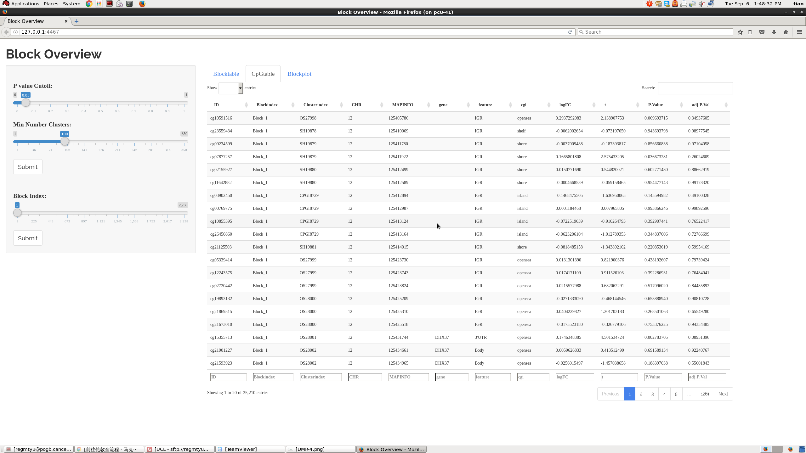
```

The second tab provides information of all CpGs involved in all Blocks. For methylation blocks, there are actually three unit integrated together: Block, Cluster (regions) and CpG. Blocks are formed by some clusters, and clusters are formed by some CpGs. Thus the second tab actually provides a mapping solution from CpGs to Blocks. User may use this tab to find interesting genes and CpGs. Then use DMP.GUI() to combind research between Blocks and DMPs.

```{r, out.width = 800, fig.retina = NULL,echo=FALSE}
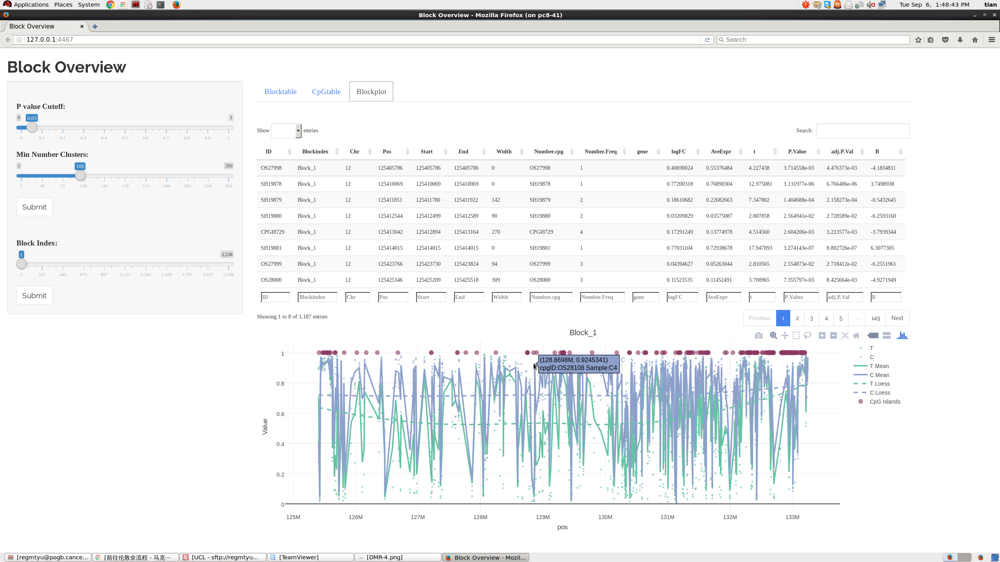
```
The third tab provides the plot for each Blocks. **Be caution that each Block may contain many many clusters. Thus it would be slow to calculate and plot. And please make sure you have a good computer or server to run this function.** Note that plot is slightly different from DMR.GUI() and DMP.GUI() that the x axis is actually the `REAL MAPINFO` of each cluster, because I also need to map CpG islands position above the lines (Those dark red dots).

## Gene Set Enrichment Analysis
Gene Set Enrichment Analysis is a very important step for most bioinformatics work. After previous steps, you may already get some significant DMPs or DMRs, thus you may want to know if genes involved in these significant DMPs or DMRs are enriched for specific biological terms or pathways. To achieve this analysis, you can use champ.GSEA() to do GSEA analysis.

champ.GSEA() would automatically extract genes in `myDMP` and `myDMR` (No matter what method you have used to generate DMRs). Also if you have your own significant CpG list or gene list calculated from `THE SAME` methylation arrays (450K or EPIC) by other method not included in ChAMP. You may also format them into `list` and input the function to do GSEA (Please assign each element in your own CpG list or gene list a name, otherwise error might be triggered). champ.GSEA() would automatically extract gene information, transfer CpG information into gene information then conduct GSEA on each list. During the mapping process between CpGs to genes, if there are multiple CpGs mapped to one gene, that gene would only be counted once in case of over counting.

There are three ways to do GSEA. In previous version, ChAMP used pathway information downloaded from [MSigDB](http://software.broadinstitute.org/gsea/msigdb/index.jsp). Then **Fisher Exact Test** will be used to calculate the enrichment status of each pathway. After gene enrichment analysis, champ.GSEA() function would automatically return pathways with P-value smaller then adjPval cutoff.

However, as pointed out by Geeleher [citation], since different genes has different numbers of CpGs contained inside, the two situation that one genes with 50 CpGs inside but only one of them show significant methylation, and one gene with 2 CpGs inside but two are significant methylated should not be eaqualy treated. The solution is use number of CpGs contained by genes to correct significant genes. as implemented in the gometh function from missMethyl package [@Phipson2016]. In gometh function, it used number of CpGs contained by each gene replace length as biased data, to correct this issue. The idea of gometh is fitting a curve for numbers of CpGs across genes related with GSEA, then using the probability weighting function to correct GO's p value.

**In recent version, we incoporated a new empirical bayes GSEA method into champ.GSEA() function, which is short for "ebayes" in "method" parameter**. This method would not relying on DMP or DMR result to do GSEA, but instead would use global test to directly find significant genes, with the bias of inequality of CpG number corrected for each genes. Also this method considered the significant degree of of each CpG, thus user may use this method to detect some marginal significant genes for GSEA process.

> Note: If you want to fix bias from inequality of CpG number of genes, and take significant level of CpGs into consideration, you could set "method" parameter as "ebayes" to use empirical bayes method. Otherwise, you may use "gometh" method or "fisher" method to do GSEA as well.

User may use following command to do GSEA:

```{r eval=FALSE}
myGSEA <- champ.GSEA(beta=myNorm,DMP=myDMP[[1]], DMR=myDMR, arraytype="450K",adjPval=0.05, method="fisher")
# myDMP and myDMR could (not must) be used directly.
```
> If you don't want to do GSEA on DMP or DMR, you may set them as NULL.

In above code, we also used the demo 450K array incorporated in our package to demonstrate the effect of champ.GSEA(). After the calculation, for each list (DMP,DMR or other list), one GSEA result would be returned. User may check the result like below:

```{r eval=TRUE}
head(myGSEA$DMP)
# Above is the GSEA result for differential methylation probes.
head(myGSEA$DMR)
# Above is the GSEA result for differential methylation regions.
# Too many information may be printed, so we are not going to show the result here.
```

### Empirical Bayes GSEA method

As we introduced before, ChAMP now incorporated a new method called "ebayes" in champ.GSEA(), this method is different from most other GSEA method because it does not need DMP or DMR information. Thus actually users could run this method separately from champ.GSEA(). We provided champ.ebay() function in ChAMP, for users who want to directly do GSEA from normalized beta matrix and phenotype. Like below:

```{r eval=FALSE}
myebayGSEA <- champ.ebGSEA(beta=myNorm,pheno=myLoad$pd$Sample_Group,arraytype="450K")
```
This is a promising GSEA method, without bias from number of CpGs enriched in genes, or significant level of CpGs.


## Differential Methylated Interaction Hotspots

Another function included in ChAMP is champ.EpiMod(). This function uses [FEM](https://www.bioconductor.org/packages/devel/bioc/html/FEM.html)  package to infer differentially methylated gene modules within a user-specific functional gene-network. This network could be e.g. a protein-protein interaction network. Thus, the champ.EpiMod() function can be viewed as a functional supervised algorithm, which uses a network of relations between genes (usually a PPI network), to identify subnetworks where a significant number of genes are associated with a phenotype of interest (POI). The EpiMod algorithm can be run in two different modes: at the probe level, in which case the most differentially methylated probe is assigned to each gene, or at the gene-level in which case a DNAm value is assigned to each gene using an optimized procedure described in detail in Jiao Y, Widschwendter M, Teschendorff AE Bioinformatics 2014. Originally, the FEM package was developed to infer differentially methylated gene modules which are also deregulated at the gene expression level, however here we only provide the EpiMod version, which only infers differentially methylated modules. More advanced user may refer to FEM package for more information.


User may use following code to do champ.EpiMod()

```{r eval=FALSE}
myEpiMod <- champ.EpiMod(beta=myNorm,pheno=myLoad$pd$Sample_Group)
```

The all significant modules would be returned. And PDF version plots would returned in resultsDir in function parameter. Like below:

```{r, out.width = 800, fig.retina = NULL,echo=FALSE}
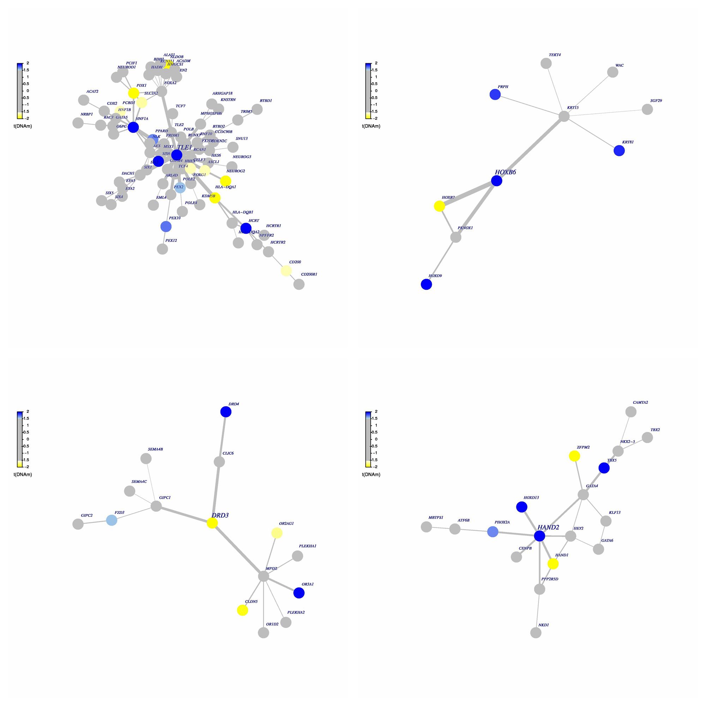
```

Above we demonstrated four modules detect by champ.EpiMod() based on our small 450K test data. But in practice, each modules would be saved in to a pdf file individually in resultsDir directory.

## Copy Number Variation

For Copy Number Variation analysis, we provide champ.CNA() to achieve this work. This function uses the HumanMethylation450 or HumanMethylationEPIC data to identify copy number alterations [@Feber14]. The function utilises the intensity values for each probe to count copy number and determine if copy number alterations are present. Copy number is determined using the CopyNumber package.

Basically there are two methods you may choose to do CNA analysis: you may compare the copy number various between case samples and control samples; or you can compare copy number of each sample to the average copy number status of all samples. For the first method, you may specify which groups of samples in your pheno parameter, or ChAMP already included some blood control samples itself, you may use them as control then calculate the copy number variance, all you need to do is assign parameter `control=TRUE` and `controlGroup="champCtls"`. For the other method, you may assign `control=FALSE` to apply.

There are two kinds of plots would be generated, analysis for each sample (`sampleCNA=TRUE` parameter) and analysis for each group (`groupFreqPlots=TRUE` parameter). Like champ.QC() function before, there are two parameter could be assigned for plots. The Rplot parameter would control if champ.CNA() would plot with R session, and PDFplot parameter would control if champ.CNA() would save PDF file to resultsDir. By default, only PDFplot is TRUE.


> Note that different from old version of ChAMP. **No batch correction would be run automatically on intensity data**, if you want to correct batch effect on intensity data, please use champ.runCombat(), the usage for intensity data is exactly the same for beta or M matrix, the only difference is you need to replace the beta value with `myLoad$intensity` and set `logitTrans=FALSE`.

Feber [@Feber14] compared the results obtained using this method to copy number data from Illumina CytoSNP array and Affymetrix SNP 6.0 arrays and found that using this method for 450k data was effective in identifying regions of gain and loss.

Users may use following code to calculate Copy Number Variance:
```{r eval=FALSE}
myCNA <- champ.CNA(intensity=myLoad$intensity,pheno=myLoad$pd$Sample_Group)
```

The main usage of champ.CNA() function is to generate plot for sample and groups in pheno. Like below:

```{r, out.width = 800, fig.retina = NULL,echo=FALSE}
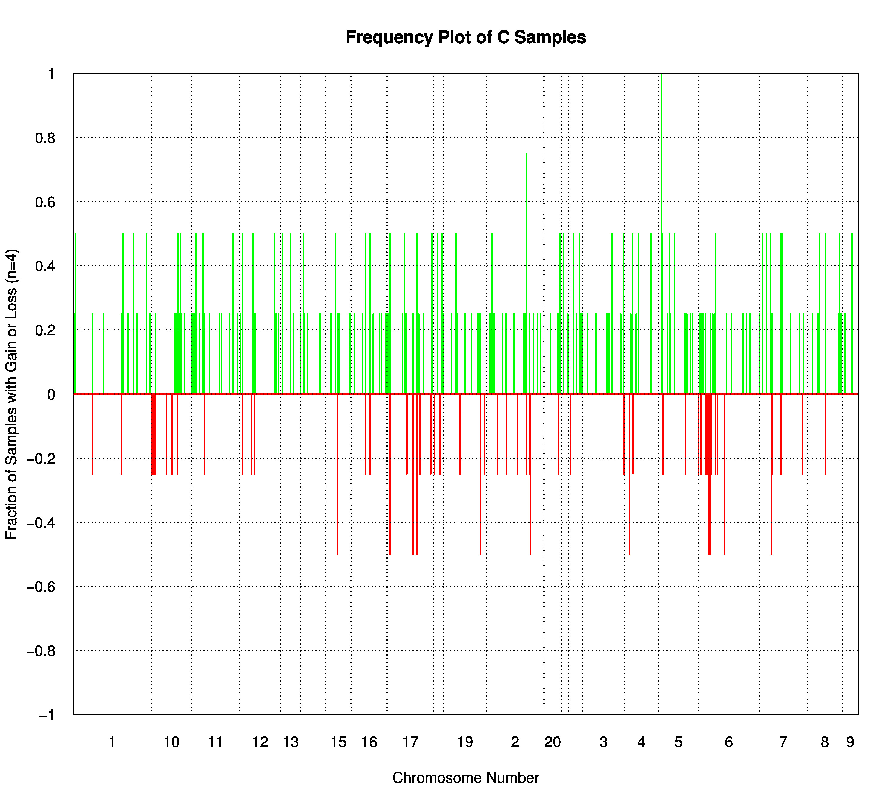
```

## Cell Type Heterogeneity

DNA methylation profiles are usually generated in samples that constitute mixtures over many cell-types. Given that DNAm is highly cell-type specific, thus there is often the need to infer DMPs/DMRs which are not driven by underlying changes in cell-type composition. Many methods have been proposed to deal with the cell-type heterogeneity problem, like RefbaseEWAS.

RefbaseEWAS method uses a reference-database of DNAm profiles of the major cell-types thought to be present in the tissue of interest, and uses this reference to infer sample-specific cell-type proportions using a form of constrained multivariate regression, known as constrained projection or quadratic programming. These cell-type proportions can subsequently be used as covariates to infer phenotype-associated changes which are not driven by changes in cell-type composition. We included this refbase method into our ChAMP for users who want to detect cell proportion and remove cell type influence on their **WHOLE BLOOD** data.

In ChAMP, we include a reference databases for whole blood, one for 27K and the other for 450K. After champ.refbase() function, cell type heterogeneity corrected beta matrix, and cell-type specific proportions in each sample will be returned. Do remember champ.refbase() can only works on Blood Sample Data Set.

```{r eval=FALSE}
myRefBase <- champ.refbase(beta=myNorm,arraytype="450K")
# Our test data set is not whole blood. So it should not be run here.
```

> Note that our demo 450K array is not whole blood data, so champ.refbase() can not works on this data set. Above code is only demo here. In the future, we will add more reference for champ.refbase function.

# Summary

We have briefly described the various pipelines and functions included in the new ChAMP package. In the future we hope to improve it further, along with more functionality. If you have any question, bug report, or suggestion for improving ChAMP, please email it to champ450k@gmail.com. Feeback is key for improving a package which tries to seamlessly incorporate functionality and flexibility from many other tools.


# Citing ChAMP

ChAMP is a wrapper incorporating algorithms and functions from many other sources. The majority of functions used in ChAMP are incorporated directly from other packages or are drawn from specific published algorithms. Hence, below we provide guidance on which papers should be cited alongside ChAMP when using these functions:

If you use the ChAMP package, please cite:

> Morris, T. J., Butcher, L. M., Feber, A., Teschendorff, A. E., Chakravarthy, A. R., Wojdacz, T. K., and Beck, S. (2014). Champ: 450k chip analysis methylation pipeline pg - 428-30. Bioinformatics, 30(3), 428-30.

The loading part of ChAMP (champ.load) uses minfi package, so please cite:

> Aryee MJ, Jaffe AE, Corrada-Bravo H, Ladd-Acosta C, Feinberg AP, Hansen KD and Irizarry RA (2014). Minfi: A flexible and comprehensive Bioconductor package for the analysis of Infinium DNA Methylation microarrays. Bioinformatics, 30(10), pp. 1363-1369. doi: 10.1093/bioinformatics/btu049.

> Jean-Philippe Fortin, Timothy Triche, Kasper Hansen. Preprocessing, normalization and integration of the Illumina HumanMethylationEPIC array. bioRxiv 065490; doi: https://doi.org/10.1101/065490

Filtering out probes with SNPs was based following recommendations presented in this paper:

> Zhou W, Laird PW and Shen H: Comprehensive characterization, annotation and innovative use of Infinium DNA Methylation BeadChip probes. Nucleic Acids Research 2016

FunctionalNormliazation and SWAN normalization methods are based on:

> Jean-Philippe Fortin, Timothy Triche, Kasper Hansen. Preprocessing, normalization and integration of the Illumina HumanMethylationEPIC array. bioRxiv 065490; doi: https://doi.org/10.1101/065490

> Maksimovic J et a. SWAN: Subset-quantile within array normalization for illumina infinium humanmethylation450 beadchips. Genome Biol. 2012;13(6):R44.

The default type-2 probe correction method in ChAMP is BMIQ, based on:

> Teschendorff AE et al . A beta-mixture quantile normalization method for correcting probe design bias in illumina infinium 450 k dna methylation data. Bioinformatics. 2013;29(2):189-196.

Another type-2 probe correction method is PBC, which was presented in:

> Dedeurwaerder S et a. Evaluation of the infinium methylation 450K technology. Epigenomics. 2011;3(6):771-784.

champ.SVD() function is based on:

> Teschendorff AE et a. An epigenetic signature in peripheral blood predicts active ovarian cancer. PLoS One. 2009;4(12):e8274.

ChAMP uses the batch correction method Combat as implanted in the `SVA` package. Please cite:

> Johnson WE et a. Adjusting batch effects in microarray expression data using empirical bayes methods. Biostatistics. 2007;8(1):118-127.

> Leek JT, Johnson WE, Parker HS, Fertig EJ, Jaffe AE, Storey JD, Zhang Y and Torres LC (2017). sva: Surrogate Variable Analysis. R package version 3.24.4.

Above are all functions related to `Data Normalization`. Below are functions and methods for downstream analyses.

If using [limma](https://bioconductor.org/packages/release/bioc/html/limma.html) to find DMPs, please cite:

>  Smyth GK. Linear models and empirical bayes methods for assessing differential expression in microarray experiments. Stat Appl Genet Mol Biol. 2004;3:Article3. Epub 2004 Feb 12. PubMed PMID: 16646809.

> Wettenhall JM, Smyth GK. limmaGUI: a graphical user interface for linear
modeling of microarray data. Bioinformatics. 2004 Dec 12;20(18):3705-6. Epub 2004 Aug 5. PubMed PMID: 15297296.

For DMR detection, if you used Bumphunter method, please cite:

> Jaffe AE et a. Bump hunting to identify differentially methylated regions in epigenetic epidemiology studies. Int J Epidemiol. 2012;41(1):200-209.

If you used ProbeLasso function, please cite:

> Butcher LM, Beck S. Probe lasso: A novel method to rope in differentially methylated regions with 450K dna methylation data. Methods. 2015;72:21-28.

Or if you used [DMRcate](https://bioconductor.org/packages/release/bioc/html/DMRcate.html) function, please cite:

> Peters TJ, Buckley MJ, Statham AL, et al. De novo identification of differentially methylated regions in the human genome. Epigenetics & Chromatin. 2015;8(1):1-16.

In this version of ChAMP, we provided a function to find Differential Methylation Blocks (DMB). The reference should be:

> Hansen KD, Timp W, Bravo HC, et al. Increased methylation variation in epigenetic domains across cancer types. Nat Genet. 2011;43(8):768-775.

> Timp W, Bravo HC, McDonald OG, et al. Large hypomethylated blocks as a universal defining epigenetic alteration in human solid tumors. Genome Med. 2014;6(8):61.

For GSEA method, if you used 'gometh' method, please cite below paper:

> Paul Geeleher, Lori Hartnett, Laurance J. Egan, Aaron Golden, Raja Affendi Raja Ali, and Cathal Seoighe Gene-set analysis is severely biased when applied to genome-wide methylation data Bioinformatics 2013 : btt311v2-btt311.

> Young MD, Wakefield MJ, Smyth GK and Oshlack A (2010). "Gene ontology analysis for RNA-seq: accounting for selection bias." Genome Biology, 11, pp. R14.

> Phipson, B, Maksimovic, J, Oshlack, A (2016). missMethyl: an R package for analyzing data from Illumina's HumanMethylation450 platform. Bioinformatics, 32, 2:286-8.

If you used the [FEM](http://bioconductor.org/packages/release/bioc/html/FEM.html) package to find Differential Methylated Modules in gene networks, please cite:

> Jiao Y, Widschwendter M, Teschendorff AE. A systems-level integrative framework for genome-wide dna methylation and gene expression data identifies differential gene expression modules under epigenetic control. Bioinformatics. 2014;30(16):2360-2366.

The CNA detection function was provided by Andy Feber of UCL, you may citate related paper below:

> Feber A, Guilhamon P, Lechner M, et al. Using high-density dna methylation arrays to profile copy number alterations. Genome Biol. 2014;15(2):R30.

We included two methods for cell proportion correction.  If you used the Refbase method in ChAMP, please cite:

> Houseman EA, Accomando WP, Koestler DC, et al. DNA methylation arrays as surrogate measures of cell mixture distribution. BMC Bioinformatics. 2012;13(1):1-16.


# References
